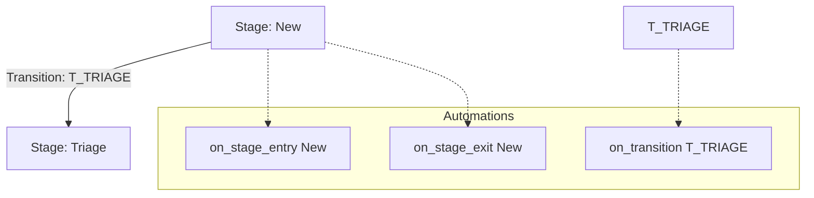

# Blueprint Configuration - UI Architecture & Data Relationships

**Session**: 2026-03-27 ~23:37 IST

This document serves as the **Single Source of Truth** for the Automation Blueprint editor, detailing the components, data mapping, and logical relationships between stages, transitions, and automations.

## 1. UI Hierarchy & Component Roles

The blueprint editor is a modular system built on Ant Design, organized into four primary managers:

| Component | Responsibility | Primary Data Key |
|-----------|----------------|------------------|
| `ProcessBlueprintConfig` | **Orchestrator**: Handles loading, saving, and normalizing data between the backend and UI. | `definition` |
| `StageManager` | **Nodes**: Manages the lifecycle states (Metadata, RACI, Categories). | `lifecycle.stages` |
| `TransitionManager` | **Edges**: Manages movements between stages (Manual/Auto triggers, Guard Rules, Icons). | `lifecycle.transitions` |
| `AutomationManager` | **Triggers**: Manages background logic attached to stages or transitions. | `automations` |
| `ActionConfigForm` | **Logic Steps**: The specific configuration for steps within an automation (Email, Entity creation, RPC). | `actions` |

---

## 2. Logical Relationships

The blueprint is represented as a **State Machine** where transitions and automations are "bound" to specific states (stages).

### A. Stages vs. Automations
A Stage (e.g., `New`) acts as a container for two primary trigger events:
- **`on_stage_entry`**: Executes immediately when an entity moves into this stage.
- **`on_stage_exit`**: Executes just before an entity leaves this stage.

### B. Transitions vs. Automations
A Transition (e.g., `T_TRIAGE`) is the path between two stages. 
- **Trigger Type**: `manual` (requires a button click) or `auto` (moves once conditions are met).
- **`on_transition`**: An automation triggered by the act of moving via this specific path. This is useful for logic that should only happen for *this path*, even if multiple transitions lead to the same "To" stage.

### C. Relationship Diagram

---

## 3. Data Normalization (Single Source of Truth)

To enable a user-friendly UI while keeping the backend engine compatible, we use a **Transformation Layer** in the `ProcessBlueprintConfig` component.

### Automations Mapping
| Backend (Nested Object) | UI (Flat Array/Grouped) |
|-------------------------|-------------------------|
| Organized by Event Type: `{"on_stage_entry": {"New": {...}}}` | Flattened for display: `[{event: "on_stage_entry", target_id: "New", ...}]` |
| **Logic**: Engine lookups. | **Logic**: Easier to sort, search, and group into sections. |

### Configuration Mapping
| Field | UI Property | Backend JSON Property |
|-------|-------------|-----------------------|
| Display Name | `label` | `label` |
| Trigger Mode | `is_manual` (Toggle) | `trigger: "manual" \| "auto"` |
| Logic Step | `type` | `action_type` |
| Rules | `condition` | `condition` (RuleGroupType) |

---

## 4. Automation Deep-Dive (Rules & Actions)

Each Automation consists of two parts: **The Guard (Rule)** and **The Payload (Actions)**.

### Trigger Conditions (Rules)
- **Editor**: `react-querybuilder`.
- **Purpose**: A gatekeeper. If the condition evaluates to `false`, the actions are skipped.
- **Data Source**: Current entity values (e.g., `priority == "High"`).

### Execution Pipeline (Actions)
Actions are executed **sequentially**. If `stop_on_failure` is enabled, any failure in Step 1 will prevent Step 2 from running.

#### Supported Action Types:
1. **`send_email`**:
   - `template_id`: Remote template reference.
   - `recipients`: Dynamic sources (e.g., `{{entity.owner_email}}`).
2. **`create_entity`**:
   - `entity_name`: Target table (e.g., `tasks`).
   - `payload`: JSON template for the new record.
3. **`rpc`**:
   - `rpc_name`: Database function to execute (e.g., `schema.recalculate_sla`).
   - `args`: Arguments passed to the function.

---

## 5. Summary of Modified Files

1.  [`ProcessBlueprintConfig.tsx`](file:///c:/Users/ganesh/zoworks/vite_tanstack_zoworks_v2/src/modules/settings/pages/Config/ProcessBlueprintConfig.tsx): Core normalization & state locking.
2.  [`TransitionManager.tsx`](file:///c:/Users/ganesh/zoworks/vite_tanstack_zoworks_v2/src/modules/settings/pages/Config/components/ProcessBlueprint/TransitionManager.tsx): Guard rules and UI styling mapping.
3.  [`AutomationManager.tsx`](file:///c:/Users/ganesh/zoworks/vite_tanstack_zoworks_v2/src/modules/settings/pages/Config/components/ProcessBlueprint/AutomationManager.tsx): Multi-view toggle (List/Grouped) and event targeting.
4.  [`ActionConfigForm.tsx`](file:///c:/Users/ganesh/zoworks/vite_tanstack_zoworks_v2/src/modules/settings/pages/Config/components/ProcessBlueprint/ActionConfigForm.tsx): Concrete forms for `send_email`, `create_entity`, and `rpc`.
