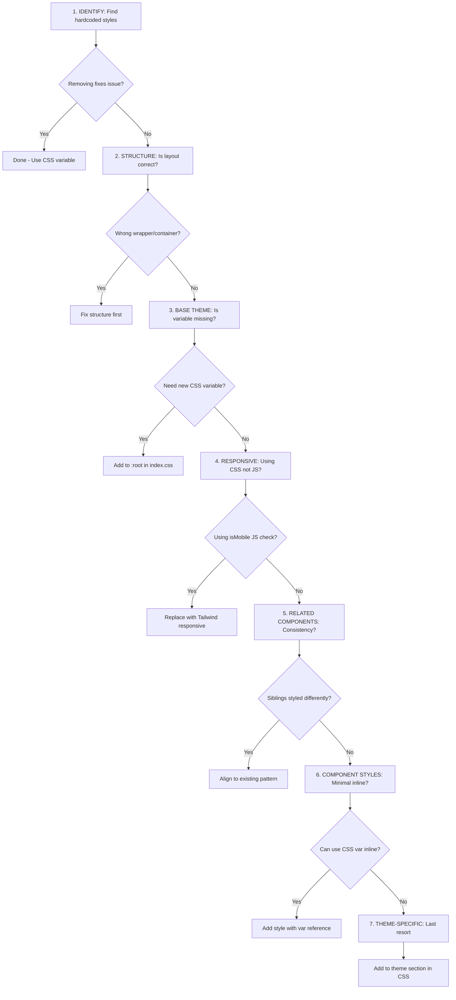

# Theme Styling Audit & Enforcement Workflow

// turbo-all

This workflow ensures all components strictly adhere to the Zoworks styling system. **NO HARDCODED VALUES. NO STYLE LEAKS.**

> **References:**
> - [Theme Engine Guide](file:///docs/frontend/patterns/theme-engine.md)
> - [Page Layouts](file:///docs/frontend/patterns/page-layouts.md)
> - [Layout Reference](file:///docs/frontend/patterns/layout-reference.md)

---

## ⚠️ CRITICAL: Pre-Fix Analysis Rules

> [!CAUTION]
> **BEFORE making any styling fix**, follow these rules. Violating them creates inconsistent, fragile CSS that breaks across the app.

### Rule 1: Impact Analysis First

**Before writing any code**, check what other components/pages will be affected:

```bash
# Find all usages of the class/component you're about to modify
grep -r "header-icon-btn" src/ --include="*.tsx" --include="*.css"

# Check related components in the same directory
ls -la src/core/components/Layout/

# Find similar patterns elsewhere
grep -r "margin.*-.*offset" src/ --include="*.css"
```

**Checklist:**
- [ ] Identified ALL pages/components using the affected class
- [ ] Verified the fix improves ALL usages, not just the current one
- [ ] Tested at multiple breakpoints before AND after
- [ ] Documented which files are affected in the commit

### Rule 2: Never Fix Named Elements (Use Positional Selectors)

**❌ NEVER target specific elements by name:**
```css
/* BAD - Targets hamburger icon by name */
.hamburger-button { margin-left: -12px; }

/* BAD - Targets profile specifically */
.profile-avatar { margin-right: -12px; }
```

**✅ ALWAYS use positional selectors:**
```css
/* GOOD - First icon in header gets left offset */
.header-icons > :first-child { margin-left: ... }

/* GOOD - Last element in header group */
.header-icons > :last-child { margin-right: ... }

/* GOOD - Any header icon button (generic class) */
.header-icon-btn { ... }
```

**Why:** Named selectors break when elements are reordered, renamed, or new ones added. Positional selectors describe the ROLE, not the IDENTITY.

### Rule 3: Use Global Variables & Multiples

**All values must derive from base variables:**

| Base Variable | Derived Values |
|---------------|----------------|
| `--header-height: 56px` | `calc(var(--header-height) / 2)` → icon size |
| `--layout-padding: 24px` | `calc(var(--layout-padding) * 0.5)` → tight spacing |
| `--tenant-gutter: 16px` | `calc(var(--tenant-gutter) * 2)` → double spacing |

**❌ NEVER:**
```css
width: 28px;          /* Magic number */
margin-left: -12px;   /* Where did 12 come from? */
gap: 8px;             /* Arbitrary value */
```

**✅ ALWAYS:**
```css
width: var(--header-icon-size);                           /* Derived from header-height */
margin-left: calc(-1 * var(--header-icon-offset));        /* Calculable from variables */
gap: calc(var(--tenant-gutter) * 0.5);                    /* Multiple of base gutter */
```

### Rule 4: Responsive-First Approach

**Design for mobile, enhance for desktop:**

```css
/* Mobile-first: Base styles apply to mobile */
.header-icon-btn {
  width: var(--header-icon-size);
  height: var(--header-icon-size);
}

/* Desktop enhancement: Override only what changes */
@media (min-width: 768px) {
  .header-icon-btn {
    /* Only add desktop-specific changes */
  }
}
```

**Responsive checklist:**
- [ ] Default (no media query) = mobile
- [ ] Use Tailwind responsive prefixes: `md:` for tablet+, `lg:` for desktop+
- [ ] CSS media queries use `min-width` (mobile-first)
- [ ] Test at: 375px, 768px, 1024px, 1440px

### Rule 5: Container Handles Spacing, Elements Handle Sizing

**Clear separation of responsibilities:**

| Responsibility | Owner | Examples |
|----------------|-------|----------|
| Outer margins | Container | `.header { padding: ... }` |
| Element spacing | Container | `.header { gap: ... }` |
| Element size | Element | `.header-icon-btn { width: ... }` |
| Internal alignment | Element | `.header-icon-btn { display: flex; align-items: center }` |

**❌ DON'T mix responsibilities:**
```tsx
<Button style={{ marginLeft: '16px' }}>  {/* Element adding spacing = bad */}
```

**✅ DO separate them:**
```tsx
<div className="flex gap-4">            {/* Container handles gaps */}
  <Button className="header-icon-btn" /> {/* Button only handles its own sizing */}
</div>
```

### Rule 6: Fix Globally, Verify Everywhere

**After making a fix:**
1. Check ALL affected components (from Rule 1 analysis)
2. Test in both light AND dark modes
3. Test at ALL breakpoints (mobile, tablet, desktop)
4. If the fix breaks something else, the fix is wrong — go back to analysis

```bash
# After any CSS change, verify related components
yarn dev
# Then manually check: /welcome, /dashboard, /inbox, /settings
```

### Rule 7: Interactive Target Requirements

> [!IMPORTANT]
> All interactive elements must have consistent hit areas across ALL devices (touch AND mouse).

**Minimum requirements:**
- **Hit area size**: 44x44px minimum (Apple HIG / consistent hover)
- **Icon buttons**: If icon is 20-28px, button container should be 44px
- **Edge alignment**: First/last buttons use negative margins to align icons with container edges

**Available variables:**
```css
:root {
  --header-icon-size: 28px;              /* Visual icon/avatar size */
  --interactive-target-size: 44px;       /* Consistent hit area across devices */
  --edge-icon-offset: calc((var(--interactive-target-size) - 20px) / 2);  /* 12px offset for flush alignment */
}
```

**Edge alignment pattern:**
```css
/* Pull edge buttons flush with container edge */
.header-icon-btn.edge-left {
  margin-left: calc(-1 * var(--edge-icon-offset));
}

/* Mobile only - desktop profile uses auto-width for name */
@media (max-width: 767px) {
  .header-icon-btn.edge-right {
    margin-right: calc(-1 * var(--edge-icon-offset));
  }
}
```

**Interactive target checklist:**
- [ ] All icon buttons use `--interactive-target-size` (44px)
- [ ] Edge buttons use `.edge-left` / `.edge-right` for flush alignment
- [ ] Same hit area on mobile AND desktop
- [ ] Test hover state on desktop, tap on mobile

---

## Styling Fix Priority Order (FOLLOW THIS HIERARCHY)

> [!IMPORTANT]
> When diagnosing or fixing any styling issue, **follow this order strictly**. Each level builds on the previous.



### Level 1: Remove Hardcoded Styles First
**Before anything else**, search for and remove hardcoded values:
```bash
grep -rE "padding:\s*[0-9]+px|margin:\s*[0-9]+px|width:\s*[0-9]+px|height:\s*[0-9]+px" {TARGET}
grep -rE "size=\{[0-9]+\}|max-w-\[[0-9]+px\]|-m[lrtbxy]-[0-9]" {TARGET}
```
- Does removing the hardcoded value fix the issue? → **Done**
- If not, proceed to Level 2

### Level 2: Correct Structure
- Is the component using the correct layout wrapper? (`.page-content`, `.page-card`)
- Is the flex/grid structure correct?
- Is the container handling padding, not the element?

### Level 3: Correct Base Theme
- Is there a CSS variable for this value? If not, should there be?
- Derived values should use `calc()` with base variables
- Example: `--header-icon-size: calc(var(--header-height) / 2)`

### Level 4: Use Responsive CSS (Not JavaScript)
- ❌ Avoid: `{isMobile && <Component />}`
- ✅ Prefer: `className="md:hidden"` (CSS-based responsive)
- JS device detection is for behavior, CSS is for visibility/sizing

### Level 5: Align Related Components
- Are sibling/related components styled consistently?
- Use same spacing, sizing, alignment patterns
- Example: Hamburger and Profile avatar should have matching offsets

### Level 6: Minimal Component Dynamic Styles
- If base CSS fixes don't cover the case, add **minimal** inline styles in the component
- Must use CSS variables, not hardcoded values:
  ```tsx
  // ✅ Good: Uses CSS variable
  style={{ marginLeft: 'calc(-1 * var(--header-icon-offset))' }}
  
  // ❌ Bad: Hardcoded value
  style={{ marginLeft: '-12px' }}
  ```
- Keep component-specific styles to an absolute minimum

### Level 7: Theme-Specific (Absolute Last Resort)
- Only if the issue is genuinely theme-specific (light vs dark mode)
- Always support both modes when adding theme rules
- Add to the appropriate section in `index.css`

---

## Usage

Run this workflow on a specific module or folder:

```bash
# Audit a specific module
/styling-component-checklist src/modules/tickets

# Audit core components
/styling-component-checklist src/core/components/DynamicViews

# Audit all pages in a module
/styling-component-checklist src/modules/workforce/pages
```

---

## 1. Layout Pattern Matching (CRITICAL)

**Match the page to one of 5 documented layout patterns:**

> [!IMPORTANT]
> Reference: [Layout Patterns](file:///docs/frontend/patterns/page-layouts.md#layout-patterns)

### Step 1: Identify Current Structure

Examine the page and determine what type of content it displays:
- Dashboard/Analytics with widgets? → **Dashboard Layout**
- Hero/landing with columns? → **Hero Layout**
- Table/list of records? → **Table Layout**
- Grid/kanban of cards? → **Card Grid Layout**
- Stacked content sections? → **Multi-Card Layout**

### Step 2: Apply Matching Pattern

| Pattern | Class Combo | When to Use |
|---------|-------------|-------------|
| **Dashboard** | `page-card page-card-flush` | Widget grids, analytics |
| **Hero** | `page-card` (internal grid) | Welcome, onboarding |
| **Table** | `page-card page-card-flush` | Data tables, lists |
| **Card Grid** | `page-card page-card-flush` | Kanban, grid views |
| **Multi-Card** | Multiple `page-card` | Settings, stacked sections |

### Step 3: Wrap Existing Content

```tsx
// Before (any old structure)
<>
  <PageActionBar>...</PageActionBar>
  <OldWrapper>
    <ExistingContent />
  </OldWrapper>
</>

// After (matching pattern)
<div className="page-content layout-canvas">
  <PageActionBar>...</PageActionBar>
  <div className="page-card page-card-flush">
    <ExistingContent />  {/* Keep internal structure intact */}
  </div>
</div>
```

### Step 4: If No Pattern Matches

If the page doesn't fit any known pattern, **ASK THE USER**:

```markdown
## Layout Pattern Question

This page doesn't match any documented layout pattern.
Current structure: [describe what you see]

**Options:**
1. Dashboard Layout (widget grid, flush padding)
2. Hero Layout (two-column with internal grid)
3. Table Layout (single card, flush padding)
4. Card Grid Layout (grid of item cards)
5. Multi-Card Layout (stacked sections)
6. New Pattern (describe what you need)

Which pattern should I apply?
```

### Consistency Checklist

- [ ] Page wrapped in `.page-content.layout-canvas` or `.page-content.layout-record`
- [ ] At least one `.page-card` exists
- [ ] `PageActionBar` sits OUTSIDE `.page-card`
- [ ] Content aligns to layout padding edges (`--layout-padding`)
- [ ] No inline styles on `.page-card`
- [ ] No nested `.page-card` inside another `.page-card`

### Migration Rules (CRITICAL)

> [!IMPORTANT]
> When migrating pages to `.page-card`:
> - **ONLY wrap existing content** — don't restructure or redesign
> - Keep all columns, grids, and internal layouts intact
> - Don't add inline styles to `.page-card`
> - Don't remove existing animations (CSS handles it)

**DO THIS:**
```tsx
// Before (fragment + old classes)
<>
  <PageActionBar>...</PageActionBar>
  <div className="layout-canvas entry-animate">
    <div className="content-body">
      <TwoColumnLayout>...</TwoColumnLayout>  
    </div>
  </div>
</>

// After (page-content + page-card wrapping existing structure)
<div className="page-content layout-canvas">
  <PageActionBar>...</PageActionBar>
  <div className="page-card">
    <TwoColumnLayout>...</TwoColumnLayout>  {/* Same internal structure */}
  </div>
</div>
```

**DON'T DO THIS:**
```tsx
// ❌ Don't restructure internal layout
// ❌ Don't add inline styles like style={{ background: 'transparent' }}
// ❌ Don't split existing content into multiple page-cards unless needed
```

---

## 2. Spacing & Padding Audit

Scan for hardcoded padding/margin values:

```bash
grep -rE "padding:\s*[0-9]+px|margin:\s*[0-9]+px" {TARGET} --include="*.tsx" --include="*.css"
```

### Required Variables

| Purpose | Variable | Default |
|---------|----------|---------|
| Page/card padding | `var(--layout-padding)` | 24px |
| Mobile padding | `var(--layout-padding-mobile)` | 16px |
| Gaps/gutters | `var(--tenant-gutter)` | 16px |

### Checks
- [ ] No hardcoded `padding: 24px` — Use `var(--layout-padding)`
- [ ] No hardcoded `gap: 16px` — Use `var(--tenant-gutter)`
- [ ] Responsive padding uses `--layout-padding-mobile` for mobile

---

## 3. Border Radius Audit

```bash
grep -rE "border-radius:\s*[0-9]+px" {TARGET} --include="*.tsx" --include="*.css"
```

### Required Variables

| Purpose | Variable | Default |
|---------|----------|---------|
| Cards, modals, large containers | `var(--tenant-border-radius)` | 12px |
| Buttons, inputs, interactive | `var(--tenant-border-radius-interactive)` | 10px |

### Checks
- [ ] No hardcoded `border-radius: 12px` — Use `var(--tenant-border-radius)`
- [ ] No hardcoded `border-radius: 8px` on buttons — Use `var(--tenant-border-radius-interactive)`

---

## 4. Sizing & Proportional Relationships

> [!IMPORTANT]
> **AVOID HARDCODED PIXEL VALUES** — Use CSS variables and derived calculations for all sizing.

### Principles

1. **Derive from Base Variables**
   - Avoid: `size={28}`, `width="32px"`, `max-width: 80px`
   - Use: `var(--header-icon-size)`, `calc(var(--header-height) / 2)`

2. **Proportional Relationships**
   - Icon/avatar size should relate to container height (e.g., `container-height / 2`)
   - Offsets should derive from the values they're offsetting
   - Example: `--header-icon-offset: calc(var(--header-icon-size) - var(--layout-padding-mobile))`

3. **Responsive Container Padding**
   - Use Tailwind responsive classes for padding: `px-4 md:px-6`
   - Or use CSS variable with media query handling

4. **Edge Flush Alignment**
   - When an element needs to appear flush with container edge (ignoring its internal padding), use negative margins derived from variables
   - Example: `marginLeft: 'calc(-1 * var(--header-icon-offset))'`

5. **Container vs Element Responsibility**
   - **Container**: handles external padding/margins (layout-level spacing)
   - **Element**: handles internal sizing (icon size, avatar size)
   - Don't mix these responsibilities

### Available Sizing Variables

```css
:root {
  /* Base */
  --layout-padding: 24px;           /* Desktop */
  --layout-padding-mobile: 16px;    /* Mobile */
  --header-height: 56px;

  /* Derived */
  --header-icon-size: calc(var(--header-height) / 2);  /* 28px */
  --header-icon-offset: calc(var(--header-icon-size) - var(--layout-padding-mobile));  /* 12px */
}
```

### Checks
- [ ] No hardcoded pixel values for sizes that should scale
- [ ] Proportional sizes use `calc()` with base variables
- [ ] Responsive padding uses Tailwind classes or media queries
- [ ] Edge alignment offsets derive from the values they offset

---

## 5. Typography Audit

```bash
grep -rE "font-size:\s*[0-9]+px" {TARGET} --include="*.tsx" --include="*.css"
```

### Typography Scale (All Relative to --tenant-font-size)

| Class | Multiplier | @14px | @16px |
|-------|------------|-------|-------|
| `.text-h1` / h1 | 2.285x | 32px | 36.5px |
| `.text-h2` / h2 | 1.714x | 24px | 27.4px |
| `.text-h3` / h3 | 1.428x | 20px | 22.8px |
| `.text-h4` / h4 | 1.285x | 18px | 20.6px |
| `.text-h5` / h5 | 1.142x | 16px | 18.3px |
| `.text-h6` / h6 | 1.0x | 14px | 16px |
| `.text-title` | 1.571x | 22px | 25.1px |
| `.text-subtitle` | 1.0x | 14px | 16px |
| `.text-small` | 0.857x | 12px | 13.7px |
| `p` / body | 1.0x | 14px | 16px |

### Checks
- [ ] No hardcoded `font-size: 24px` — Use `.text-h2` or `calc(1.714 * var(--tenant-font-size))`
- [ ] No hardcoded `font-size: 14px` — Use `var(--tenant-font-size)`
- [ ] No hardcoded `font-size: 12px` — Use `.text-small` or `calc(0.857 * var(--tenant-font-size))`

---

## 6. Color Leak Audit

```bash
grep -rE "blue-|indigo-|slate-|#([0-9a-fA-F]{3}){1,2}" {TARGET} --include="*.tsx" --include="*.ts"
```

### Required Variables

| Purpose | Variable |
|---------|----------|
| Backgrounds | `var(--color-bg-primary)`, `var(--color-bg-secondary)`, `var(--color-bg-tertiary)` |
| Text | `var(--color-text-primary)`, `var(--color-text-secondary)` |
| Borders | `var(--color-border)` |
| Primary brand | `var(--tenant-primary)` |

### Checks
- [ ] No Tailwind color classes (`bg-blue-50`)
- [ ] No hardcoded hex colors (`#ffffff`)
- [ ] Transparency uses RGB: `rgba(var(--color-primary-rgb), 0.1)`

---

## 7. Icon Compliance

```bash
grep -r "@ant-design/icons" {TARGET} --include="*.tsx"
```

- [ ] **Lucide Icons ONLY**: No Ant Design icons allowed
- [ ] Icon sizes: `size={14}` buttons, `size={18}` menus, `size={20}` header

---

## 8. Branding System

- [ ] **NO raw `` for logos**: Use `<BrandLogo />` or `<BrandIcon />`

---

## 9. Responsive Pattern Check

- [ ] **Tabs**: Inline on desktop, dropdown on mobile
- [ ] **Filters**: Inline on desktop, drawer on mobile
- [ ] **Primary Action**: Icon+text on desktop, icon-only on mobile

---

## 9. Drawer & Modal Settings

```bash
grep -rE "mask=\{?false" {TARGET} --include="*.tsx"
```

### Checks
- [ ] **All Drawers have mask**: No `mask={false}` unless explicitly intended (e.g., non-blocking info panel)
- [ ] **Modal mask**: Ensure modals darken background consistently

### Common Issues
```tsx
// ❌ WRONG - Background not darkened
<Drawer mask={false} ...>

// ✅ CORRECT - Background darkens properly
<Drawer mask={true} ...>
// or simply omit mask prop (defaults to true)
<Drawer ...>
```

---

## 10. Dark Mode Color Consistency

```bash
grep -rE "bg-slate-|border-slate-|text-slate-" {TARGET} --include="*.tsx"
```

### Checks
- [ ] **No hardcoded slate colors in dark mode**: Use CSS variables instead
- [ ] **Conditional dark mode classes use variables**: `isDarkMode ? 'bg-[var(--color-bg-secondary)]' : ...`

### Common Issues
```tsx
// ❌ WRONG - Hardcoded Tailwind colors conflict with theme
${isDarkMode ? 'bg-slate-950/40 border-slate-800' : ...}

// ✅ CORRECT - Uses CSS variables that respect theme
${isDarkMode ? 'bg-[var(--color-bg-secondary)] border-[var(--color-border)]' : ...}
```

### Color Variable Reference (Neon Dark Theme)
| Variable | Color | Usage |
|----------|-------|-------|
| `--color-bg-primary` | `#061612` | Darkest surfaces |
| `--color-bg-secondary` | `#0a1f1a` | Cards, panels |
| `--color-bg-tertiary` | `#0d2920` | Elevated surfaces |
| `--color-border` | `rgba(255,255,255,0.1)` | Borders |

---

## Fixing Patterns

### Hardcoded Padding
```tsx
// ❌ WRONG
<div style={{ padding: '24px' }}>

// ✅ CORRECT
<div style={{ padding: 'var(--layout-padding)' }}>
```

### Hardcoded Font Size
```tsx
// ❌ WRONG
<span style={{ fontSize: '12px' }}>Small text</span>

// ✅ CORRECT
<span className="text-small">Small text</span>
```

### Hardcoded Border Radius
```tsx
// ❌ WRONG
<Card style={{ borderRadius: '12px' }}>

// ✅ CORRECT
<Card style={{ borderRadius: 'var(--tenant-border-radius)' }}>
```

---

## Audit Report Template

```markdown
## Styling Audit: {MODULE_NAME}

**Date**: YYYY-MM-DD
**Files Audited**: X

### Page Structure
- [ ] All pages use .page-card
- [ ] No nested .page-card

### Spacing
- Hardcoded padding found: X
- Fixed: X

### Border Radius
- Hardcoded radius found: X
- Fixed: X

### Typography
- Hardcoded font-size found: X
- Fixed: X

### Color Leaks
- Found: X
- Fixed: X

### Icons
- Ant Design icons found: X
- Replaced: X
```

---

*Last Updated: 2025-12-26*
