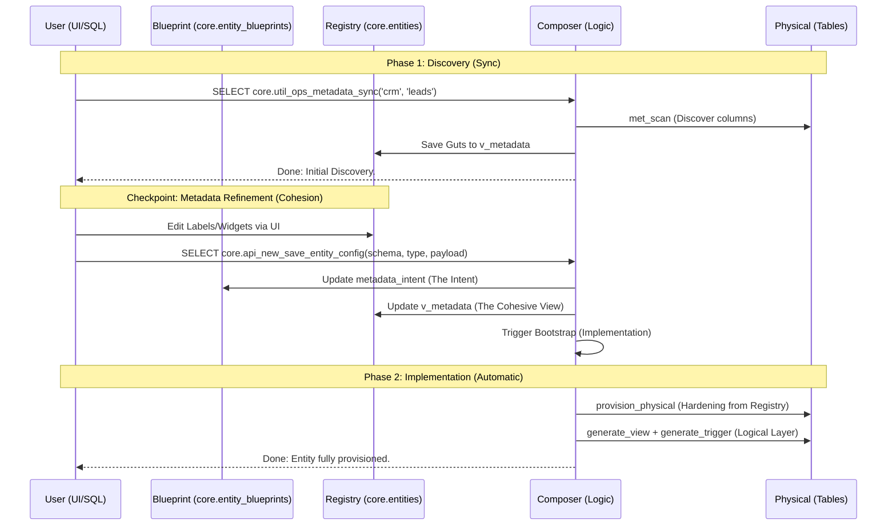

# Registry-First Managed Bootstrap Strategy

This document outlines the **Registry-First Managed Bootstrap Strategy**. It leverages `core.entities` as the central metadata registry, allowing users to inspect, correct, and finalize entity metadata before the logical layer (views/triggers) is implemented.

## 🏗️ Architecture: The Registry-Aware Model

In this model, the **Composer** is "Registry-Aware"—it seeks existing metadata in `core.entities` before resorting to a fresh schema scan.

### Sequence Diagram

---

## 🚦 Operational Workflow

## 🚦 Operational Workflow (RPC Reference)

### Phase 1: Discovery (The Registry Checkpoint)
Run this to populate the Registry with initial discoveries. 
**RPC:** `core.util_ops_metadata_sync(p_schema, p_entity, p_overwrite_manual)`

- **`p_overwrite_manual` (bool, default: false)**: 
    - `false`: PROTECTS your UI edits. Only appends NEWly found columns.
    - `true`: WIPES your UI edits. Resets everything to DB defaults.

### Phase 2: Metadata Correction (The Cohesion Engine)
Do **not** edit tables directly. Use the Unified Save RPC which handles the architectural split.
**RPC:** `core.api_new_save_entity_config(p_schema_name, p_entity_type, p_config)`

- **`p_config`**: Should contain the cohesive `metadata` array (the "Cohesive View").
- **Action**: This splits the data:
    - **Intent** (Labels, Widgets) goes to `core.entity_blueprints.metadata_intent`.
    - **Cohesion** (Total View) goes to `core.entities.v_metadata`.
    - **Provisioning**: Automatically triggers `core.comp_util_ops_bootstrap_entity`.

### Phase 3: Final Implementation (Automatic)
In the new architecture, Phase 2 automatically triggers Phase 3. You only need to run the manual bootstrap if you want to force a refresh from the physical table.
**RPC:** `core.comp_util_ops_bootstrap_entity(p_schema_name, p_entity_type, NULL, p_force_refresh)`

- **`p_force_refresh := true`**: Re-scans DB and rebuilds everything (Discarding registry changes).

---

## 🧹 Rollback & Physical Purity (Reset)

If you need to start from scratch or remove composer "decorations" while keeping your physical data intact, use the cleanup utility.

### RPC: Safe Cleanup
`core.comp_util_ops_cleanup_entity(p_schema, p_entity, p_drop_phys_cols, p_clear_registry)`

- **`p_drop_phys_cols := true`**: Drops all `details__*` columns generated by the composer.
- **`p_clear_registry := true`**: Empties the `v_metadata` array in the registry.

| Goal | Command Logic |
| :--- | :--- |
| **"Soft Reset"** | `cleanup(..., false, true)` -> View dropped, registry cleared. |
| **"Physical Purity"** | `cleanup(..., true, true)` -> View dropped, `details__*` dropped, registry cleared. |
| **"Start from Scratch"** | `cleanup(..., true, true)` followed by `util_ops_metadata_sync(...)`. |

> [!WARNING]
> Cleanup uses the **Registry (`v_metadata`)** as its map. It specifically targets columns marked as `is_phys_generated`. It is safe to use as long as your base columns are NOT prefixed with `details__`.

---

## 📋 Operational Protocol

1.  **Sync**: `SELECT core.util_ops_metadata_sync('crm', 'leads');`
2.  **Edit**: UPDATE `core.entities` SET `v_metadata = ...` WHERE ...
3.  **Deploy**: `SELECT core.comp_util_ops_bootstrap_entity('crm', 'leads');`
4.  **Refine**: If wrong, run **Cleanup** and start over.

Here is your step-by-step guide for a Managed Bootstrap of crm.leads. These commands are designed to be run in your SQL Editor.

Phase 1: Discovery Sync
Run this first. It scans the physical tables and JSONB fields of crm.leads and creates a draft in the Registry.

sql
-- Creates or updates the record in core.entities
-- Protecting manual edits by default (p_overwrite_manual := false)
SELECT core.util_ops_metadata_sync('crm', 'leads', false);
Phase 2: Inspection & Manual Correction
Now, "Checkpoint" your work. You can inspect what the bot found and make adjustments.

1. Inspect the discovered metadata:

sql
SELECT v_metadata 
FROM core.entities 
WHERE entity_schema = 'crm' AND entity_type = 'leads';
2. Make Corrections (Example): If you want to make email mandatory and change its display name, run an update like this (or do it via your UI table editor):

sql
-- Example: Renaming a field and making it mandatory in the registry
UPDATE core.entities
SET v_metadata = (
    SELECT jsonb_agg(
        CASE 
            WHEN val->>'key' = 'email' THEN 
                val || '{"display_name": "Primary Email", "is_mandatory": true}'::jsonb
            ELSE val 
        END
    )
    FROM jsonb_array_elements(v_metadata) AS val
)
WHERE entity_schema = 'crm' AND entity_type = 'leads';
Phase 3: Final Implementation
Complete the bootstrap. The Composer will now use your corrected Primary Email label and mandatory logic to generate the Views and Forms.

sql
-- Completes the provisioning
-- p_force_refresh := false (Ensures it uses your Registry Corrections)
SELECT core.comp_util_ops_bootstrap_entity('crm', 'leads', NULL, false);
Phase 4: Final Verification
Check that your corrections were successfully applied to the generated layer.

sql
-- 1. Check the View
SELECT * FROM crm.v_leads LIMIT 1;
-- 2. Check the Form Schema (Labels and Mandatory flags should match your edits)
SELECT core.api_new_generate_form_schema('crm.leads', '{"mode": "minimal"}'::jsonb);
🛑 Emergency: "Start Over" (Cleanup)
If you made a mistake and want to wipe everything and start from a clean slate:

sql
-- Drops the view, drops generated physical columns, and clears the registry
SELECT core.comp_util_ops_cleanup_entity('crm', 'leads', true, true);
Summary of your workflow:

-------

1. Data Preservation (JSONB is King)
The composer-generated columns (like details__first_name) are just projections of your data. The actual data lives inside the details JSONB column.

Safety: Even when we drop details__first_name, the data { "first_name": "John" } inside the details column remains 100% untouched. You can always regenerate the projection columns later.
2. The "Physical Purity" Filter
The cleanup function does not indiscriminately drop columns. It uses two strict filters:

The Map: It only looks at columns marked in your Registry (v_metadata) as is_phys_generated = true.
The Prefix: I hardened the logic to only drop columns starting with the details__ prefix.
Original Columns: Your base columns (like id, name, email, organization_id, details) do not have this prefix and are never targeted for deletion.
3. Dependency Protection
I implemented an "Exception Guard" for column drops:

If a column has a dependency that I didn't account for (e.g., you manually linked it to another system), the script skips the drop and logs a warning instead of failing or force-dropping (CASCADE) your data.