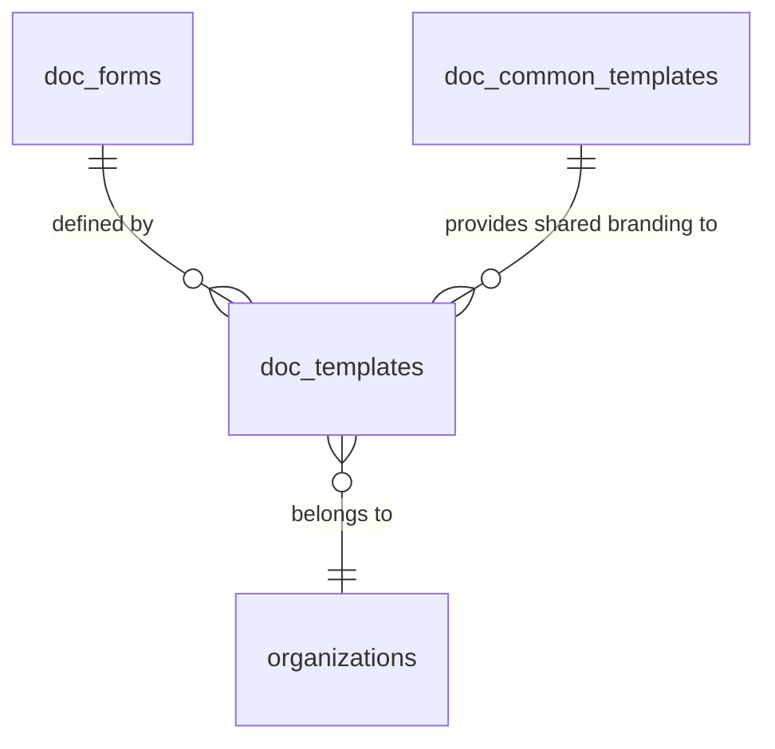

# Templates System Documentation

This document explains the architecture, data model, and flow of the template system used for generating and managing documents (e.g., invoices, service reports, purchase orders) within the project.

## 1. Database Tables Overview

The system relies on three primary tables defined in `doc\03-06-2026\templates.sql`:

### A. `doc_forms` (Schema Definition)
This table defines the structure and behavior of a document type.
*   **Purpose**: Acts as a "Blueprint" for documents.
*   **Key Columns**:
    *   `data_schema` (JSONB): The JSON Schema used to validate and structure the document's content.
    *   `ui_schema` (JSONB): Defines how the form should be rendered in the UI (layout, widgets).
    *   `type_id` (Text): A unique identifier for the document type (e.g., `invoice`, `service-report`).
    *   `data_config` (JSONB): Additional configuration for data fetching or processing.

### B. `doc_templates` (Visual & Branding)
This table stores the visual configuration for a specific `doc_form`.
*   **Purpose**: Allows an organization to have multiple "looks" (templates) for the same document type.
*   **Key Columns**:
    *   `document_type_id` (UUID): Foreign key to `doc_forms.id`.
    *   `settings` (JSONB): Visual settings like margins, font sizes, branding colors, and header/footer configurations.
    *   `is_default` (Boolean): Indicates if this is the default template for the organization and document type.
    *   `styles` (JSONB): Additional CSS-like styling properties.
    *   `doc_common_template_id` (UUID): Optional link to shared common branding.

### C. `doc_common_templates` (Shared Assets)
Shared branding settings that can be reused across different document types.
*   **Purpose**: Helps maintain consistent branding (logos, company info) across all document types.
*   **Key Columns**:
    *   `settings` (JSONB): Global branding settings applicable to multiple templates.

---

## 2. Relationships

The diagram below illustrates the connections between these entities:

- **One-to-Many**: A single `doc_forms` (e.g., "Invoice") can have multiple `doc_templates` (e.g., "Modern Blue Invoice", "Classic Professional Invoice").
- **Optional Linking**: A `doc_templates` record can optionally link to a `doc_common_templates` for shared organizational settings.

---

## 3. Data Flow

The flow of data from template creation to document rendering typically follows these steps:

### Phase 1: Configuration (Admin)
1.  **Form Definition**: An admin defines the `doc_forms` for a new entity (e.g., `credit_note`) specifying the required fields in `data_schema`.
2.  **Template Creation**: The admin creates one or more `doc_templates` for that form. Using the `TemplateCustomizer` component, they adjust colors, fonts, and headers.
3.  **Default Setting**: One template is marked as `is_default` for the organization.

### Phase 2: Document Generation (User)
1.  **Selection**: When a user goes to "Create Invoice", the system uses `DocumentService.getDocumentForm('invoice')` to fetch the schema.
2.  **Template Loading**: The system then calls `DocumentService.getDefaultTemplate(...)` to load the preferred visual settings for that organization.
3.  **UI Rendering**:
    *   `DocumentForm.tsx` uses the `ui_schema` (from `doc_forms`) to render input fields.
    *   `DynamicDocumentTemplate.tsx` applies the `settings` (from `doc_templates`) to style the page layout.
4.  **Save/Submit**: The final document content is saved to a specific table (e.g., `doc_invoices`) along with a reference to the selected template.

---

## 4. Key Components Involved

*   **`TemplateManager.tsx`**: Manages the list of available templates for a document type.
*   **`TemplateCustomizer.tsx`**: Interactive UI for editing template `settings` (colors, layout, branding).
*   **`DocumentService.ts`**: The core service layer handling Supabase queries for forms, templates, and document records.
*   **`DynamicDocumentTemplate.tsx`**: The visualization engine that merges document data with template styles.

---

## 5. Metadata Mapping
The `x_db_schema` field in `doc_forms` often contains metadata about how the JSON data maps to physical database columns, allowing the system to handle different document entities (Invoices, Service Reports, etc.) through a unified interface.
