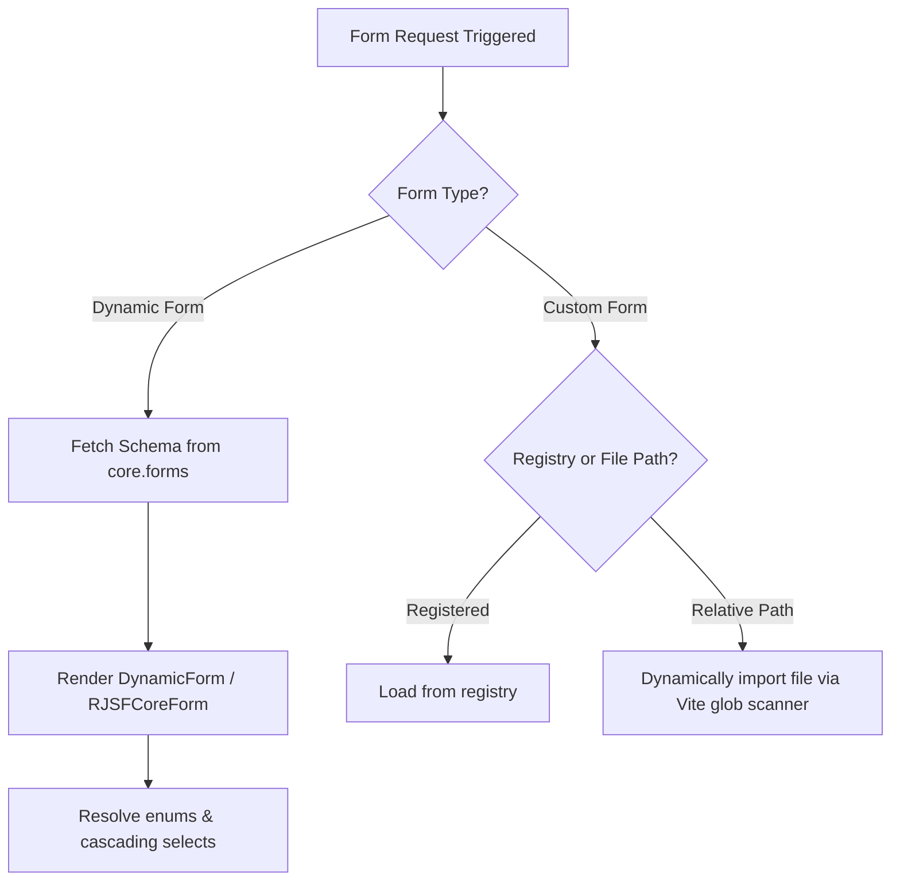
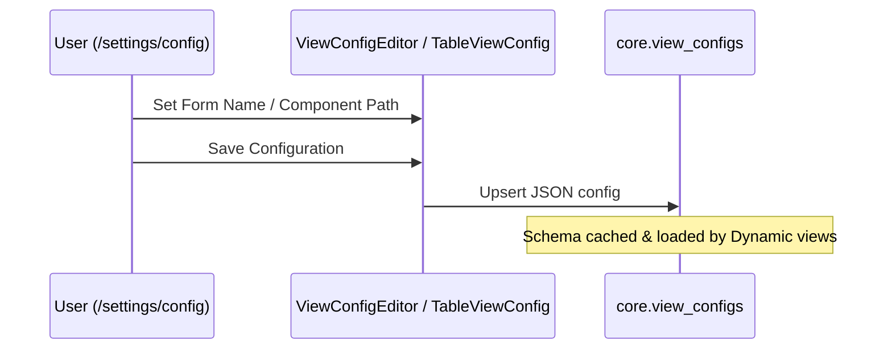

# Dynamic and Custom Form Configuration Guide

This guide explains how to build, customize, and configure forms within the system. It covers creating dynamic forms via the **RJSFCoreForm Test Bench**, building standalone **Custom React Forms**, and assigning them to entities using the **Global Actions** (View Config tab) and **Row Actions** (Table View tab) under `/settings/config`.

---

## 1. Overview of the Form Ecosystem

The system supports two methods for rendering forms:

1. **Dynamic Forms (`DynamicForm` / `RJSFCoreForm`)**: Database-driven forms powered by JSON Schema and React JSON Schema Form (RJSF). Form definitions are stored in the `core.forms` table, allowing metadata changes to alter form fields, lookups, and layouts in real-time without redeploying code.
2. **Custom Forms**: Dedicated React components for highly specialized, bespoke user experiences. These can be registered globally or resolved dynamically by file path.



---

## 2. Dynamic Forms via the RJSFCoreForm Test Bench

The RJSFCoreForm Test Bench is an interactive editor located at the route `/rjsf` (implemented in [TestRJSFCoreForm.tsx](file:///c:/Users/ganesh/zoworks/vite_tanstack_zoworks_v2/src/pages/TestRJSFCoreForm.tsx)). It allows administrators and developers to generate, customize, test, and save dynamic form configurations.

### Steps to Create a Dynamic Form:

1. **Select the Entity**:
   * Choose the target database entity (e.g. `crm.accounts` or `hr.applications`) from the dropdown. This dropdown queries active entities registered in `core.view_configs`.
2. **Select Generation Mode**:
   * **Minimal**: Generates only the fields marked as database-required.
   * **Recommended**: Generates a curated, standard set of fields.
   * **All**: Generates all columns from the database (excluding system-managed fields like `created_at` or read-only IDs).
3. **Generate Initial Schemas**:
   * Click **Generate Schema**. This triggers the Supabase database RPC `core.api_new_generate_form_schema_v3`, which returns the baseline JSON definitions:
     * **Data Schema (`data_schema`)**: Defines JSON Schema types, validation rules, titles, and lookup metadata.
     * **UI Schema (`ui_schema`)**: Configures widget mappings, placeholders, layouts, and style parameters.
     * **DB Config (`db_schema`)**: Maps the UI fields to target database tables/schemas.
4. **Customize Schemas**:
   * **JSON Code Editors**: You can edit the raw JSON text directly in the tabs for Data Schema, UI Schema, and DB Config (utilizing the built-in Ace Editors).
   * **Add/Remove Fields UI**:
     * Expand the **Add Field** section.
     * Select/input a field name, define its title, and select a widget type (e.g. text, date, textarea, file upload).
     * Set attributes like required, read-only, hidden, placeholder, or default values.
     * For select components, choose manual options (comma-separated values) or configure a dynamic database lookup (Lookup Table, Lookup Column, Lookup Schema).
     * Click **Add Field** to automatically merge the changes into `data_schema`, `ui_schema`, and layout.
   * **Configure Cascading / Dependent Dropdowns**:
     * If a Select field depends on another (e.g. *Cities* depending on *State*), specify `dependsOn` (e.g. `state_id`), `dependsOnField`, and the source column.
     * The runtime will automatically re-fetch child options whenever the parent field changes.
   * **Add Custom Submit Buttons**:
     * You can define custom buttons with custom variants (e.g., primary, dashed) and default payload overrides under **Add Button**.
   * **Arrange Grid Layout**:
     * Click **Page Manager** to visually construct multi-page steps or assign field placements in rows and columns (`ui:layout` configuration).
5. **Name and Save the Form**:
   * Enter a unique **Form Name** (e.g., `crm_accounts_edit` or `crm_accounts_create`).
   * Choose **Scope Visibility**:
     * **Global**: Check the `Global` checkbox to make it the default template across all tenants (saves with `organization_id` as `null` in `core.forms`).
     * **Org-Specific Override**: Uncheck `Global` to scope this customized form specifically for your current tenant.
   * Click **Save to forms** to write/upsert the configuration to the `core.forms` database table.

> [!TIP]
> The dynamic lookup resolver in `RJSFCoreForm` prioritizes organization-specific overrides. If a lookup table contains records for the current `organization_id` as well as global records (`organization_id IS NULL`), it will automatically isolate and show only the tenant's custom records.

---

## 3. Building Custom React Forms

For complex behaviors that cannot be handled by JSON schemas (e.g., drag-and-drop file upload handlers, complex calculators, multi-step wizards, or third-party integrations), you can implement a standard React component.

### Step 1: Create the Component File
Create a new file in one of the scanned directories:
* Pages directory: `src/pages/**/*.tsx`
* Modules directory: `src/modules/**/components/*.tsx`

Example path: [ClientBespokeForm.tsx](file:///c:/Users/ganesh/zoworks/vite_tanstack_zoworks_v2/src/modules/clients/components/ClientBespokeForm.tsx)

### Step 2: Implement the Required Drawer Interface
To integrate with the modal drawer transitions in `GlobalActions` and `RowActions`, the component must expose default exports accepting the following props:

```tsx
import React from 'react';

interface CustomFormProps {
  entityType: string;         // E.g., 'crm.accounts'
  parentEditItem?: any;       // The database record (populated during Row Edit/Actions, undefined for Create/Global Actions)
  onSuccess?: () => void;     // Callback to close drawer and invalidate React Query cache
  onClose?: () => void;       // Callback to cancel and close drawer
}

const ClientBespokeForm: React.FC<CustomFormProps> = ({
  entityType,
  parentEditItem,
  onSuccess,
  onClose
}) => {
  const handleSave = async () => {
    // Perform custom save logic / API requests here...
    if (onSuccess) onSuccess();
  };

  return (
    <div>
      <h3>Custom Actions for {entityType}</h3>
      {parentEditItem && <p>Editing: {parentEditItem.name}</p>}
      {/* Custom Inputs */}
      <button onClick={handleSave}>Submit</button>
      <button onClick={onClose}>Cancel</button>
    </div>
  );
};

export default ClientBespokeForm;
```

### Step 3: Register in the Registry (Optional)
Instead of relying on relative path resolution, you can register custom action components in the central registry at [registry.ts](file:///c:/Users/ganesh/zoworks/vite_tanstack_zoworks_v2/src/core/registry.ts):

```typescript
import { registry } from './registry';

registry.registerAction({
  id: 'custom-client-action',
  label: 'Bespoke Action',
  scope: 'row', // or 'global'
  entityType: 'crm.clients',
  component: () => import('@/modules/clients/components/ClientBespokeForm')
});
```

---

## 4. Assigning Forms in `/settings/config`

Once a form has been created (either dynamic in `core.forms` or as a custom file component), you must link it to a database entity's views inside `/settings/config`.



### 4.1 Global Actions (View Config Tab)
Global Actions represent entity-level operations (such as creating a new record or inviting users) and are displayed at the top right of dynamic views.

1. Navigate to `/settings/config` and select the target entity.
2. Open the **View Config** tab (implemented in [ViewConfigEditor.tsx](file:///c:/Users/ganesh/zoworks/vite_tanstack_zoworks_v2/src/modules/settings/pages/Config/ViewConfigEditor.tsx)).
3. Scroll down to the **Global Actions** section.
4. Click **Add Global Action**.
5. Input configuration:
   * **Form name**:
     * *For Dynamic Forms*: Enter the exact `name` matching the form in `core.forms` (e.g. `crm_accounts_create`).
     * *For Custom Forms*: Enter the relative component path (e.g., `../pages/Clients/ClientBespokeForm` or `./ClientBespokeForm`).
   * **Action label**: Enter the display label for the button (e.g., "New Account").
6. Click **Save Configuration**. This updates `core.view_configs.general.global_actions` and automatically syncs it to `core.entity_blueprints.ui_general`.

---

### 4.2 Row Actions (Table View Tab)
Row Actions represent operations triggered on individual rows within a Table View, Grid View, or other record list components.

1. Navigate to `/settings/config` and select the target entity.
2. Open the **Table View** tab (implemented in [TableViewConfig.tsx](file:///c:/Users/ganesh/zoworks/vite_tanstack_zoworks_v2/src/modules/settings/pages/Config/TableViewConfig.tsx)).
3. Scroll down to the **Actions** section -> **Row Actions** sub-section.
4. Click **Add Row Action**.
5. Input configuration:
   * **Form**:
     * *For Dynamic Forms*: Enter the exact name from `core.forms` (e.g. `crm_accounts_edit`).
     * *For Custom Forms*: Enter the relative component path (e.g. `../pages/Clients/ClientEditBespoke`).
   * **Name**: Enter the text displayed in the row's dropdown action menu (e.g., "Modify Details").
6. Click **Save Configuration** (saves details into `core.view_configs.tableview.actions.row`).

---

## 5. Under-the-Hood Execution Details

### How the UI Resolves Actions at Runtime:

1. **Configuration Fetching**:
   * Dynamic views fetch entity configurations using React Query hooks (`useEntityConfig`). The configuration includes details of global actions and row actions.
2. **Form Render Trigger**:
   * When a user triggers an action, `GlobalActions.tsx` or `RowActions.tsx` intercepts the configured `form` identifier:
     * **Registry Match**: First, fuzzy matches the form identifier against registered action IDs (from `core/registry.ts`).
     * **Custom Component Path Match**: If the form name starts with `./` or `../`, it scans directories for a matching filename, dynamically imports the default export, and loads the component into the drawer, supplying the `parentEditItem` props.
     * **Dynamic Form Fallback**: If it's not a path or registered key, the system calls `useFormConfig(formName)` to query the `core.forms` table in Supabase. It then renders `<DynamicForm>` using the returned JSON schema definitions.
3. **Upsert Logic**:
   * Submitting a dynamic form calls `supabase.schema('core').rpc('api_new_core_upsert_data')`. This SQL function automates tenant isolation (setting `organization_id` and audit metadata columns) and safely saves values to the specified table.
