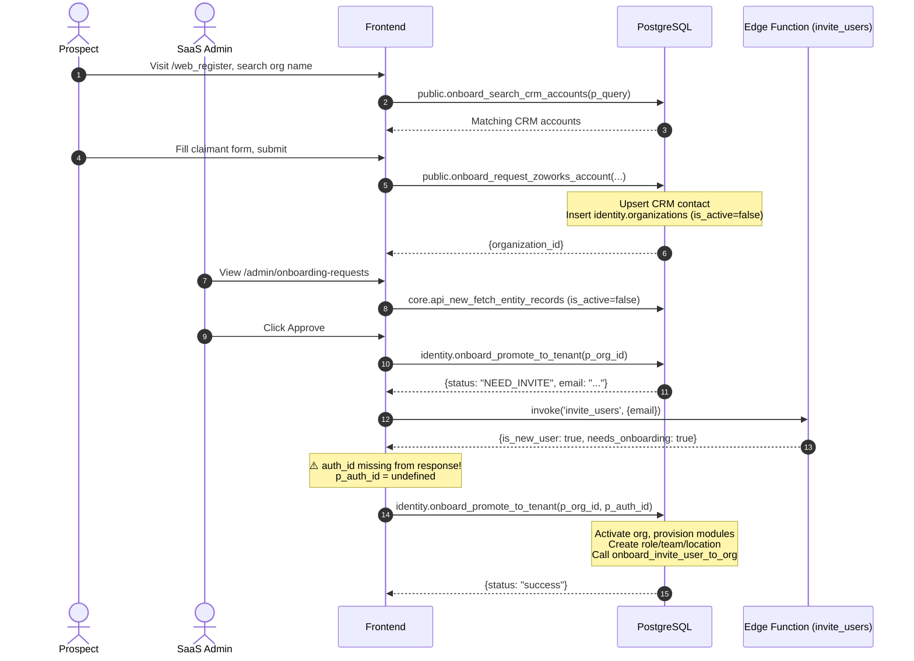
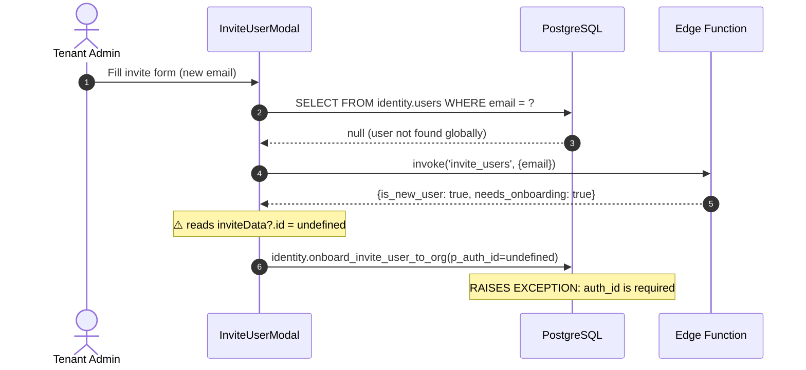
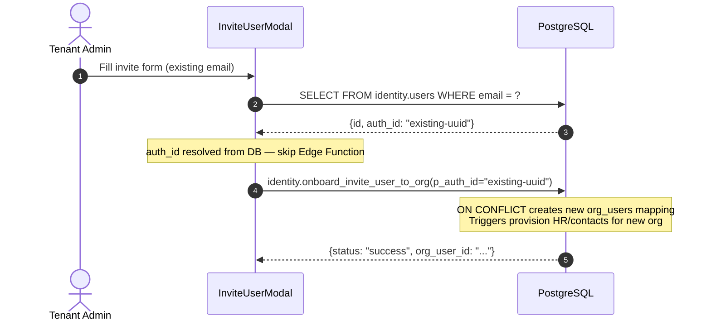
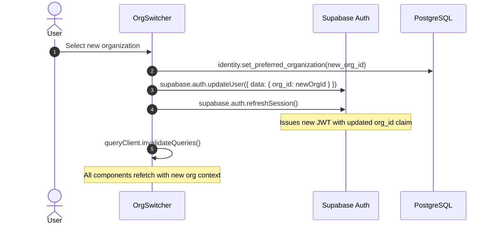

# Identity Module — Specification

> **SDD Version**: 1.0 — 2026-05-21  
> **Sources**: `src/modules/admin/`, `doc/03-09-2026/invite_user_rpc.sql`, `doc/03-10-2026/onboarding_rpcs.sql`, `doc/05-21-2026/tenant_onboarding_and_user_invitation_guide.md`, `/Users/macbookpro/zo/zo_core_v6_supa/ARCHITECTURE.md`, `/Users/macbookpro/zo/zo_core_v6_supa/identity.md`  
> **Agent instructions**: Read Sections 1–3 first for context. Read Section 4 for backend work, Section 5 for frontend work, Section 6 for E2E or integration work.

---

## 1. Business Context & Purpose

The `identity` module is the **root platform module**. It has no upstream dependencies. Every other module (CRM, HR, Workforce, ESM) depends on it for tenant isolation, user management, and access control.

It answers three questions for every other module:
1. **Who is acting?** → `identity.users` linked to `auth.users`
2. **Which organization is the context?** → `identity.organizations` + JWT `org_id` claim
3. **What are they allowed to do?** → `identity.roles` + `identity.user_roles` + RLS policies

### Platform Position
- `identity` schema is **outside the 4-Tier Object Model** (it IS the tier system's foundation).
- Exception: `identity.organization_users` participates as a **Tier 2 person pillar anchor** — it shares UUIDs with `unified.contacts`.
- JWT claims are the primary source of tenant context: `{ org_id, org_user_id, sub (auth user uuid) }`.

---

## 2. Use Cases & Business Rules

### UC-1: Self-Service Tenant Registration (CRM Prospect → Pending Org)

**Actor**: Prospective customer  
**Trigger**: Visits `/web_register`, searches for or creates an organization  
**Frontend entry point**: [`WebRegister.tsx`](file:///Users/macbookpro/zo_v2/mini_project/src/pages/auth/WebRegister.tsx)

**Business Rules**:
- BR-1.1: The search queries `crm.accounts` and filters out organizations already active in `identity.organizations`.
- BR-1.2: If the org is not found in CRM, a new `crm.accounts` record is created.
- BR-1.3: The claimant contact is upserted in `crm.contacts` on `(email)` — no duplicate contacts.
- BR-1.4: A new `identity.organizations` row is inserted with `is_active = false` (pending state).
- BR-1.5: The organization enters a holding state. No modules, roles, or user accounts are provisioned yet.

**Outcome**: A pending organization exists. A SaaS admin can see it in `/admin/onboarding-requests`.

---

### UC-2: Admin Approves Tenant (Pending Org → Active Tenant)

**Actor**: SaaS Global Admin  
**Trigger**: Views `/admin/onboarding-requests`, clicks "Approve" on a pending org  
**Frontend entry point**: [`OnboardingRequests.tsx`](file:///Users/macbookpro/zo_v2/mini_project/src/modules/admin/pages/OnboardingRequests.tsx)

**Business Rules**:
- BR-2.1: First RPC call is `identity.onboard_promote_to_tenant(p_org_id)` with no `p_auth_id`.
- BR-2.2: The RPC checks if the claimant email already has an `identity.users` record.
  - If **found**: proceeds directly to activation (skips BR-2.3).
  - If **not found**: returns `{ "status": "NEED_INVITE", "email": "..." }`.
- BR-2.3: When `NEED_INVITE`: frontend calls Edge Function `invite_users` to create the user in `auth.users` and send the invitation email.
- BR-2.4: Second RPC call: `identity.onboard_promote_to_tenant(p_org_id, p_auth_id)` with the resolved auth UUID.
- BR-2.5: On success, the RPC atomically performs all of:
  - Sets `identity.organizations.is_active = true`
  - Provisions modules from `identity.org_module_configs` based on requested modules
  - Creates a `SuperAdmin` role (`permissions = '{"*": true}'`) in `identity.roles`
  - Creates a `Headquarters` location in `identity.locations`
  - Creates a `Leadership Team` in `identity.teams`
  - Calls `identity.onboard_invite_user_to_org` to create the admin user record
  - Sets `crm.contacts.status = 'CONVERTED'` for the claimant

**Outcome**: Active tenant with SuperAdmin user, HQ location, Leadership Team, and provisioned modules.

---

### UC-3: Invite a Brand New User to an Active Tenant

**Actor**: Tenant Admin  
**Trigger**: Opens "Invite User" drawer in `/settings/team` or equivalent  
**Frontend entry point**: [`InviteUserModal.tsx`](file:///Users/macbookpro/zo_v2/mini_project/src/modules/admin/components/InviteUserModal.tsx)

**Business Rules**:
- BR-3.1: Frontend queries `identity.users` by email first. If no record found → user is globally new.
- BR-3.2: For a globally new user: call Edge Function `invite_users` to create in `auth.users` and send email.
- BR-3.3: Edge Function response for a new user: `{ "message": "Invitation sent successfully", "is_new_user": true, "needs_onboarding": true }`. Note: **does NOT return the auth UUID** in this shape — see Section 4.1 for workaround.
- BR-3.4: Call `identity.onboard_invite_user_to_org` with `p_auth_id` to create `identity.users` + `identity.organization_users`.
- BR-3.5: `p_team_id`, `p_role_id`, `p_location_id` are optional. If omitted, the user mapping is created without assignments — they can be added later via a second call (idempotent upsert).
- BR-3.6: Database triggers on `identity.organization_users` INSERT automatically provision: HR profile (`hr.profiles`), unified contact (`unified.contacts`), financial profile (`finance.financial_profiles`), core unified object.

**Outcome**: New user exists in auth, `identity.users`, and `identity.organization_users`. Invitation email sent.

---

### UC-4: Invite an Existing Global User to an Additional Tenant (Cross-Tenant)

**Actor**: Tenant Admin  
**Trigger**: Same "Invite User" drawer, but email already exists globally  
**Frontend entry point**: [`InviteUserModal.tsx`](file:///Users/macbookpro/zo_v2/mini_project/src/modules/admin/components/InviteUserModal.tsx)

**Business Rules**:
- BR-4.1: Frontend finds existing `identity.users` record → resolves `auth_id` from it.
- BR-4.2: **Skip** the Edge Function `invite_users` — user already has auth credentials. No email sent.
- BR-4.3: Call `identity.onboard_invite_user_to_org` directly with the existing `auth_id`.
- BR-4.4: The RPC's `INSERT INTO identity.organization_users ... ON CONFLICT DO UPDATE` creates a new tenant mapping or reactivates an existing one.
- BR-4.5: All bonded extension triggers fire as normal (HR profile, contacts etc.) for the new org context.
- BR-4.6: User can now switch to the new org via the org switcher — requires `identity.set_preferred_organization()` + `supabase.auth.refreshSession()` to update JWT claims.

**Outcome**: Existing user now has access to a second tenant. No duplicate auth accounts created.

---

### UC-5: Login & Session Bootstrap

**Actor**: Any User  
**Trigger**: Successfully logs in via Supabase Auth  
**Frontend entry point**: [`Login.tsx`](file:///Users/macbookpro/zo_v2/mini_project/src/pages/auth/Login.tsx), [`useUserSession.ts`](file:///Users/macbookpro/zo_v2/mini_project/src/core/hooks/useUserSession.ts)

**Business Rules**:
- BR-5.1: After successful auth, fetch the user's available organizations via `identity.get_my_organizations()`.
- BR-5.2: If `pref_organization_id` is set on `identity.users`, auto-select it and redirect.
- BR-5.3: If multiple orgs and no pref, show the org selection screen.
- BR-5.4: Upon selection, call `identity.set_preferred_organization(org_id)` and invoke `supabase.auth.refreshSession()` to update the JWT claims with the new `org_id`.
- BR-5.5: `useUserSession` boots up relying on the JWT `org_id` claim, falling back to DB query if missing. Calls `jwt_get_user_session` to fetch full permissions.

---

### UC-6: Admin Manages User Assignments (Edit)

**Actor**: Tenant Admin  
**Trigger**: Edits a user's roles, teams, or location  
**Frontend entry point**: [`Users.tsx`](file:///Users/macbookpro/zo_v2/mini_project/src/modules/admin/pages/Settings/Users.tsx)

**Business Rules**:
- BR-6.1: Updates to location directly modify `identity.organization_users.location_id`.
- BR-6.2: Updates to roles delete existing records in `identity.user_roles` for that user/org, and insert the new ones.
- BR-6.3: Updates to teams delete existing records in `identity.user_teams`, and insert the new ones.
- BR-6.4: ⚠️ MUST include `organization_id` in inserts to `user_teams` and `user_roles` for RLS to allow the insert.

---

### UC-7: Admin Deactivates/Reactivates User

**Actor**: Tenant Admin  
**Trigger**: Clicks Deactivate/Activate in Users list  
**Frontend entry point**: [`Users.tsx`](file:///Users/macbookpro/zo_v2/mini_project/src/modules/admin/pages/Settings/Users.tsx)

**Business Rules**:
- BR-7.1: Updates `is_active` boolean on `identity.organization_users`.
- BR-7.2: Database trigger `reassign_reports_on_deactivation_trg` automatically fires to handle subordinates if the user is a manager.

---

### UC-8: Organization Module Configuration

**Actor**: SaaS Global Admin or Tenant Admin  
**Trigger**: Saves settings in the module config screen  
**Frontend entry point**: [`ModuleConfigForm.tsx`](file:///Users/macbookpro/zo_v2/mini_project/src/modules/admin/pages/Settings/ModuleConfigForm.tsx)

**Business Rules**:
- BR-8.1: Frontend fetches the platform module hierarchy via `identity.get_module_hierarchy()`.
- BR-8.2: Frontend fetches the tenant's current config via `identity.get_organization_module_configs(org_id, scope)`.
- BR-8.3: Updates are saved via `identity.save_module_configs()` (Note: Currently missing from identity schema dump, investigate).

---

### UC-9: Role Permissions Management

**Actor**: Tenant Admin  
**Trigger**: Edits role permissions in settings  
**Frontend entry point**: [`RolePermissions.tsx`](file:///Users/macbookpro/zo_v2/mini_project/src/modules/admin/pages/Settings/RolePermissions.tsx)

**Business Rules**:
- BR-9.1: Uses `identity.get_applicable_config_type_values` to fetch available permission scopes.
- BR-9.2: Direct upsert to `identity.roles` with the updated JSONB `permissions` object.

---

### UC-10: Location Hierarchy Management

**Actor**: Tenant Admin  
**Trigger**: Creates or edits an office location  
**Frontend entry point**: [`LocationsPage.tsx`](file:///Users/macbookpro/zo_v2/mini_project/src/pages/identity/LocationsPage.tsx)

**Business Rules**:
- BR-10.1: Standard CRUD operations via DynamicViews.
- BR-10.2: Database trigger `trg_update_location_path` automatically maintains the materialized path for hierarchy querying.

---

### UC-11: Post-Login Organization Switching

**Actor**: Any User  
**Trigger**: Selects a different workspace from the header  
**Frontend entry point**: [`OrgSwitcher.tsx`](file:///Users/macbookpro/zo_v2/mini_project/src/modules/wa/components/common/OrgSwitcher.tsx)

**Business Rules**:
- BR-11.1: Uses `identity.get_my_organizations()` to populate the dropdown.
- BR-11.2: Selection calls `identity.set_preferred_organization()` followed by a mandatory `supabase.auth.refreshSession()`.
- BR-11.3: Redirection to the new tenant context URL.

---

## 3. Schema Overview

### Core Tables

| Table | Classification | Tier | RLS | Notes |
|-------|---------------|------|-----|-------|
| `identity.organizations` | `configuration` | Outside tier system | ⚠️ **Effectively OFF** | `FORCE RLS` set, but no `ENABLE` statement. Policies: `Config_Insert_V5`, `Config_Tenant_Or_Global_V5` |
| `identity.users` | `master` / global | Outside tier system | ⚠️ **Effectively OFF** | `FORCE RLS` set, but no `ENABLE`. Policy: `identity_users_cohesion_policy` |
| `identity.organization_users` | `master` / `anchor` | **Tier 2 person pillar** | ✅ `Multi_Org_Access_V5` | Tenant membership. UUID shared with `unified.contacts`. |
| `identity.roles` | `configuration` | N/A | ✅ `Config_Tenant_Or_Global_V5` | RBAC roles per org. `permissions jsonb`. |
| `identity.teams` | `configuration` | N/A | ✅ `Tenant_Isolation_V5` | Team groupings per org. |
| `identity.locations` | `configuration` | N/A | ✅ `Multi_Org_Access_V5` | Office/branch locations per org. |
| `identity.user_roles` | `transactional` | N/A | ✅ `Tenant_Isolation_V5` | Maps `organization_users` → `roles`. Requires `organization_id` for RLS. |
| `identity.user_teams` | `transactional` | N/A | ✅ `Tenant_Isolation_V5` | Maps `organization_users` → `teams`. Requires `organization_id` for RLS. |
| `identity.modules` | `configuration` | N/A | ✅ Multiple | Platform module catalog. Policies: Global Read, Tenant Write/Update/Delete |
| `identity.org_module_configs` | `configuration` | N/A | ✅ `Tenant_Isolation_V5` | Per-org module activation. |
| `identity.location_types` | `configuration` | N/A | ✅ `Tenant_Isolation_V5` | Types of locations. |

### Key Relationships
```
auth.users (Supabase Auth)
    ↑ auth_id FK
identity.users (global platform user)
    ↑ user_id FK
identity.organization_users (tenant membership = Tier 2 anchor)
    ↑ organization_user_id FK          ↑ organization_user_id FK
identity.user_roles                    identity.user_teams
    ↑ role_id FK                           ↑ team_id FK
identity.roles                         identity.teams
```

---

## 4. Backend Contracts

### 4.1 Edge Functions

#### `invite_users`

| Property | Value |
|----------|-------|
| **Path** | Deployed to Supabase Edge Functions (not in local `/supabase/functions/`) |
| **JWT Verification** | ✅ **DISABLED** (`--no-verify-jwt`) |
| **Auth required** | Only `apikey` header with publishable key. `Authorization` header optional. |

**Request Body**:
```json
{ "email": "user@example.com", "organization_id": "uuid-optional" }
```

**Response Shapes** (varies by user state):

Shape A — New user (created in `auth.users`):
```json
{
  "message": "Invitation sent successfully",
  "is_new_user": true,
  "needs_onboarding": true
}
```

Shape B — User already exists in `auth.users` but not onboarded:
```json
{
  "message": "User already exists in Auth but needs onboarding",
  "auth_user_id": "2a4ed346-4c61-450f-86f2-5c816ae3fa73",
  "is_new_user": false,
  "needs_onboarding": true
}
```

> ⚠️ **IMPORTANT**: Shape A does NOT return the auth UUID. The frontend (`InviteUserModal.tsx` line 235) reads `inviteData?.id` which will be `undefined` for Shape A. This means the `p_auth_id` passed to the next RPC will be `null`, which throws `auth_id is required for new users`. **This is an active bug — see CHANGE_LOG.md CHANGE-001.**

**Test command** (see `tests/edge_function_tests.http` TEST-EF-001):
```bash
curl -X POST "https://ytirobpsblbzgslcfqhn.supabase.co/functions/v1/invite_users" \
  -H "apikey: sb_publishable_R6HCTaroeh0wjAcESBa-MQ_Pr69gegS" \
  -H "Content-Type: application/json" \
  -d '{"email": "newuser@example.com", "organization_id": "a41b2216-736c-4c00-99ca-30a0cd8ca0d2"}'
```

---

### 4.2 RPC Functions

#### `public.onboard_search_crm_accounts(p_query TEXT)`

| Property | Value |
|----------|-------|
| **Purpose** | Fuzzy-search CRM accounts for the registration form |
| **Returns** | `SETOF record` — matching accounts not yet active in `identity.organizations` |
| **Called by** | `WebRegister.tsx` |
| **Idempotent** | ✅ Read-only |

**Test SQL** → TEST-SQL-001

---

#### `public.onboard_request_zoworks_account(...)`

| Property | Value |
|----------|-------|
| **Purpose** | Creates pending org from self-registration form |
| **Returns** | `JSONB` with `organization_id` |
| **Source** | `doc/03-10-2026/onboarding_rpcs.sql` |
| **Called by** | `WebRegister.tsx` |
| **Idempotent** | ⚠️ Partially — upserts CRM contact, but creates new org each call |

**Parameters**:
```sql
p_org_name          TEXT,
p_admin_first_name  TEXT,
p_admin_last_name   TEXT,
p_admin_email       TEXT,
p_admin_mobile      TEXT,
p_requested_modules JSONB  -- e.g. '["crm", "esm"]'
```

**Returns**: UUID of created `identity.organizations` record.

**SQL Actions**:
1. Resolves or creates `crm.accounts`
2. Upserts `crm.contacts` on `(email)`
3. Inserts `identity.organizations` with `is_active = false`

**Test SQL** → TEST-SQL-002

---

#### `identity.onboard_promote_to_tenant(p_org_id UUID, p_auth_id UUID DEFAULT NULL)`

| Property | Value |
|----------|-------|
| **Purpose** | Two-phase tenant activation (check user → invite if needed → activate) |
| **Returns** | `JSONB` — either `{status: "NEED_INVITE", email: "..."}` or `{status: "success", ...}` |
| **Source** | `doc/03-10-2026/onboarding_rpcs.sql` |
| **Called by** | `OnboardingRequests.tsx` (twice in sequence) |
| **Idempotent** | ⚠️ Call 1 (no auth_id) is safe to repeat. Call 2 creates records — safe with ON CONFLICT guards. |

**Phase 1 call** (no `p_auth_id`):
```sql
SELECT identity.onboard_promote_to_tenant(p_org_id := '<org_uuid>');
-- Returns: {"status": "NEED_INVITE", "email": "claimant@example.com"}
```

**Phase 2 call** (with `p_auth_id` from Edge Function):
```sql
SELECT identity.onboard_promote_to_tenant(
    p_org_id  := '<org_uuid>',
    p_auth_id := '<auth_uuid>'
);
-- Returns: {"status": "success", "organization_id": "...", "user_id": "..."}
```

**SQL Actions (Phase 2)**:
1. Sets `identity.organizations.is_active = true`
2. Provisions modules into `identity.org_module_configs`
3. Creates `SuperAdmin` role in `identity.roles` (`permissions = '{"*": true}'`)
4. Creates `Headquarters` location in `identity.locations`
5. Creates `Leadership Team` in `identity.teams`
6. Calls `identity.onboard_invite_user_to_org` (see below)
7. Updates `crm.contacts.status = 'CONVERTED'`

**Test SQL** → TEST-SQL-003, TEST-SQL-004

---

#### `identity.onboard_invite_user_to_org(...)` ← CENTRAL ENROLLMENT RPC

| Property | Value |
|----------|-------|
| **Purpose** | Add user to org — handles both new users and cross-tenant mapping. The single most important function. |
| **Returns** | `JSONB`: `{status: "success", user_id: "...", org_user_id: "..."}` |
| **Source** | [`doc/03-09-2026/invite_user_rpc.sql`](file:///Users/macbookpro/zo_v2/mini_project/doc/03-09-2026/invite_user_rpc.sql) |
| **Called by** | `InviteUserModal.tsx`, `OnboardingRequests.tsx`, `onboard_promote_to_tenant` internally |
| **Security** | `SECURITY DEFINER`, `SET search_path = identity, hr, core, public` |
| **Idempotent** | ✅ **YES** — safe to call twice. Uses `ON CONFLICT` on all inserts. |

**Parameters**:
```sql
p_email       TEXT,
p_first_name  TEXT,
p_last_name   TEXT,
p_org_id      UUID,
p_role_id     UUID    DEFAULT NULL,    -- Optional: assign role
p_team_id     UUID    DEFAULT NULL,    -- Optional: assign team  
p_location_id UUID    DEFAULT NULL,    -- Optional: assign location
p_auth_id     UUID    DEFAULT NULL,    -- Required only for new users
p_details     JSONB   DEFAULT '{}'     -- HR fields: designation, department, employment_type, mobile
```

**Internal SQL Logic** (from actual source):

```sql
-- Step 1: Get or create identity.users
SELECT id INTO v_user_id FROM identity.users WHERE email = p_email;
IF v_user_id IS NULL THEN
    -- p_auth_id REQUIRED here, raises EXCEPTION if NULL
    INSERT INTO identity.users (auth_id, name, email, details, created_by, updated_by, password_confirmed)
    VALUES (p_auth_id, v_full_name, p_email, p_details || jsonb_build_object(...), ..., false)
    RETURNING id INTO v_user_id;
END IF;

-- Step 2: Create/update organization_users mapping
INSERT INTO identity.organization_users (organization_id, user_id, location_id, is_active, persona_type, details, created_by, updated_by)
VALUES (p_org_id, v_user_id, p_location_id, true, 'worker', ...)
ON CONFLICT (organization_id, user_id) DO UPDATE SET
    location_id = EXCLUDED.location_id,
    is_active = true,
    updated_at = now()
RETURNING id INTO v_org_user_id;

-- Step 3: Enrich HR profile (non-fatal, wrapped in BEGIN...EXCEPTION)
UPDATE hr.profiles SET
    job_title = p_details->>'designation',
    department = p_details->>'department',
    employment_type = COALESCE(p_details->>'employment_type', 'full-time'),
    employment_status = 'active'
WHERE id = v_org_user_id;

-- Step 4: Assign team (optional, ON CONFLICT DO NOTHING)
IF p_team_id IS NOT NULL THEN
    INSERT INTO identity.user_teams (organization_user_id, team_id, organization_id, created_by)
    VALUES (v_org_user_id, p_team_id, p_org_id, v_current_user_id)
    ON CONFLICT (organization_user_id, team_id) DO NOTHING;
END IF;

-- Step 5: Assign role (optional, requires team_id also present)
IF p_role_id IS NOT NULL AND p_team_id IS NOT NULL THEN
    INSERT INTO identity.user_roles (organization_user_id, role_id, team_id, organization_id, created_by)
    VALUES (v_org_user_id, p_role_id, p_team_id, p_org_id, v_current_user_id)
    ON CONFLICT (organization_user_id, role_id, team_id) DO NOTHING;
END IF;
```

**Test SQL** → TEST-SQL-005, TEST-SQL-006, TEST-SQL-007

---

#### `identity.set_preferred_organization(p_org_id UUID)`

| Property | Value |
|----------|-------|
| **Purpose** | Update user's preferred org for next session |
| **Called by** | Org switcher component |
| **Idempotent** | ✅ |

---

#### Key Session / RLS Functions

| Function | Purpose |
|----------|---------|
| `identity.get_current_org_id()` | Returns `org_id` from JWT — primary tenant isolation helper |
| `identity.rls_bootstrap_entity_policy(schema, table, dry_run)` | Auto-applies V5 standard RLS policies |
| `identity.rls_get_session_context()` | Full session context (org_id, user_id, roles) |
| `identity.is_saas_admin()` | Returns true if current user has SaaS admin role |
| `identity.jwt_generate_thin_claims()` | JWT payload builder |
| `identity.jwt_get_user_session()` | Session context for RLS |
| `identity.get_my_organizations()` | Returns JSONB of user's active organizations |
| `identity.get_module_hierarchy()` | Returns full platform module catalog template |
| `identity.get_organization_module_configs(org_id, scope)` | Returns module activation config for specific tenant |
| `identity.get_applicable_config_type_values()` | Returns valid permission options based on schema/type |

---

### 4.3 Database Triggers

| Trigger | Table | Function Called | Purpose |
|---------|-------|----------------|---------|
| `reassign_reports_on_deactivation_trg` | `organization_users` (AFTER UPDATE `is_active`) | `identity.reassign_reports_on_deactivation` | Handles subordinates when a manager is deactivated |
| `trg_sync_org_user_persona` | `organization_users` (AFTER INSERT/UPDATE `persona_type`) | `identity.trg_sync_org_user_persona` | Syncs persona to registry |
| `trg_update_location_path` | `locations` (BEFORE INSERT/UPDATE `parent_id`) | `identity.update_location_path` | Maintains location hierarchy path |
| `trg_validate_user_role_assignment` | `user_roles` (BEFORE INSERT/UPDATE) | `identity.validate_team_assignment` | Validates role within team context |
| `trg_sync_user_to_unified` | `identity.users` (AFTER INSERT/UPDATE) | `identity.trg_sync_user_to_unified` | Syncs core user fields to unified |
| `trg_provision_*` | `organization_users` | `core.util_trg_provision_bonded_extension` | ⚠️ May be provisioned outside schema dump. Provisions HR/Finance/Unified records |

> **Critical**: All downstream module data (HR profile, CRM contact, financial profile) is created via provisioning triggers — not by the application. The central enrollment RPC enriches the HR profile with form data after it is provisioned.

---

## 5. Frontend Contracts

### 5.1 Routes

| Route | Component | Auth | Description |
|-------|-----------|------|-------------|
| `/web_register` | [`src/pages/auth/WebRegister.tsx`](file:///Users/macbookpro/zo_v2/mini_project/src/pages/auth/WebRegister.tsx) | ❌ Public | Self-service org registration |
| `/admin/onboarding-requests` | [`src/modules/admin/pages/OnboardingRequests.tsx`](file:///Users/macbookpro/zo_v2/mini_project/src/modules/admin/pages/OnboardingRequests.tsx) | ✅ SaaS Admin only | Approve/reject pending orgs |
| `/settings/team` or equivalent | Uses [`InviteUserModal.tsx`](file:///Users/macbookpro/zo_v2/mini_project/src/modules/admin/components/InviteUserModal.tsx) | ✅ Tenant Admin | Invite users to org |

### 5.2 Components

#### `OnboardingRequests.tsx`
- **Fetches pending orgs** via `core.api_new_fetch_entity_records` with `entity_name: 'organizations', entity_schema: 'identity', filters: [{key: 'is_active', value: false}]` + join on `crm.contacts` via `claimed_by_contact_id`.
- **Approve flow**:
  1. `supabase.schema('identity').rpc('onboard_promote_to_tenant', { p_org_id })`
  2. If `status === 'NEED_INVITE'`: `supabase.functions.invoke('invite_users', { body: { email } })`
  3. Read `authId = inviteData?.id` ← ⚠️ Returns `undefined` for new users (Shape A). See bug CHANGE-001.
  4. `supabase.schema('identity').rpc('onboard_promote_to_tenant', { p_org_id, p_auth_id: authId })`
- **Reject flow**: `core.api_new_core_upsert_data` with `is_active: false` (sets rejection state in details).
- **Query key to invalidate after success**: None currently — calls `fetchRequests()` directly.

#### `InviteUserModal.tsx`
- **Form schema** loaded from `core.forms` where `name = 'invite_user'` (dynamic form config).
- **Invite flow**:
  1. `supabase.schema('identity').from('users').select('id, auth_id').eq('email', email).maybeSingle()`
  2. If null → `supabase.functions.invoke('invite_users', { body: { email } })` → `authId = inviteData?.id` ← ⚠️ Same bug
  3. `supabase.schema('identity').rpc('onboard_invite_user_to_org', { p_email, p_first_name, p_last_name, p_org_id, p_role_id, p_team_id, p_location_id, p_auth_id: authId, p_details: {...} })`
- **Query key invalidated**: `['users', orgId]`
- **Default location**: `formData={{ location_id: location?.id }}` pre-fills from auth store.

### 5.3 API Patterns Used

```typescript
// Fetch org list (L4 fetcher)
supabase.schema('core').rpc('api_new_fetch_entity_records', { config: { ... } })

// Identity RPCs
supabase.schema('identity').rpc('onboard_promote_to_tenant', { p_org_id, p_auth_id })
supabase.schema('identity').rpc('onboard_invite_user_to_org', { p_email, ... })

// Direct table query (identity schema)
supabase.schema('identity').from('users').select('id, auth_id').eq('email', email)

// Edge Function (no JWT needed — publishable key only)
supabase.functions.invoke('invite_users', { body: { email } })

// Generic upsert
supabase.schema('core').rpc('api_new_core_upsert_data', { table_name: 'identity.organizations', data: { ... } })
```

### 5.4 Form Configuration Required

The `InviteUserModal` requires this row in `core.forms`:
```sql
SELECT * FROM core.forms WHERE name = 'invite_user';
-- Must exist and be active. Fields: email, firstName, lastName, role_id, team_id, location_id + hr details
```

---

## 6. Integration Flows

### Flow 1: New Tenant Registration → Activation



### Flow 2: Invite New User to Existing Tenant



### Flow 3: Invite Existing Global User (Cross-Tenant)



### Flow 4: Tenant Switching



---

## 7. Configuration State

For the identity module to function correctly, the following config rows must exist:

```sql
-- Verify invite_user form exists (required by InviteUserModal)
SELECT id, name, is_active FROM core.forms WHERE name = 'invite_user';
-- Expected: 1 row, is_active = true

-- Verify identity module is registered
SELECT id, name, is_active FROM identity.modules WHERE name = 'identity';
-- Expected: 1 row

-- Verify org has module configs provisioned (after tenant activation)
SELECT module_id, is_active FROM identity.org_module_configs
WHERE organization_id = '<org_id>';
-- Expected: rows for each requested module
```

---

## 8. Known Issues & Gaps

### P0 — Critical Security

| ID | Issue | Table | Fix |
|----|-------|-------|-----|
| GAP-001 | RLS is completely OFF | `identity.organizations` | `ALTER TABLE identity.organizations ENABLE ROW LEVEL SECURITY` + custom policy using `id = ANY(identity.get_my_active_org_ids())` |
| GAP-002 | RLS is completely OFF | `identity.users` | `ALTER TABLE identity.users ENABLE ROW LEVEL SECURITY` + custom policy (user sees own row; org-scoped via `organization_users`) |

### P0 — Data Integrity

| ID | Issue | Location | Fix |
|----|-------|----------|-----|
| GAP-003 | `invite_users` Edge Function Shape A doesn't return auth UUID | `invite_users` Deno function | Update Edge Function to always return `auth_user_id` in all response shapes. See CHANGE-001. |
| GAP-004 | Frontend reads `inviteData?.id` but Shape A returns `auth_user_id` key | `OnboardingRequests.tsx:123`, `InviteUserModal.tsx:235` | Read `inviteData?.id ?? inviteData?.auth_user_id` |

### P1 — Standards & Consistency

| ID | Issue | Table | Fix |
|----|-------|-------|-----|
| GAP-005 | Non-standard policy names | `teams`, `locations`, `roles`, `user_roles`, `user_teams` | Run `identity.rls_bootstrap_entity_policy()` for each table |
| GAP-006 | `identity.roles` has typo column `is_sassadmin` | `identity.roles` | Rename to `is_saas_admin` |
| GAP-007 | `identity.user_teams` RLS requires `organization_id` but direct INSERT often omits it | Direct INSERTs | Always include `organization_id` in `identity.user_teams` INSERT. See `tests/update_missing_data.sql`. |
| GAP-008 | 7 junk tables with `x_`, `z_`, `zz_` prefixes | `identity` schema | Drop after verification — see backend `identity.md` for list |

### P2 — Architecture

| ID | Issue | Notes |
|----|-------|-------|
| GAP-009 | `organization_users` blueprint has wrong dependencies (`hr.profiles` instead of `unified.contacts, core.unified_objects`) | Update blueprint row + re-bootstrap |
| GAP-010 | `identity.organizations.organization_id` column is self-referential with no FK constraint | Rename to `parent_organization_id` |
