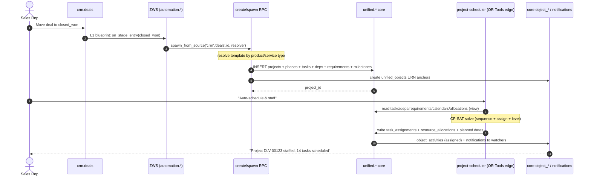

# Projects, Scheduling & Capacity — Architecture & Conceptual Block Diagram

> **Companion to**: [`MODULE_SPEC.md`](MODULE_SPEC.md) · [`USE_CASES.md`](USE_CASES.md) · [`GAP_ANALYSIS.md`](GAP_ANALYSIS.md)
> **Date**: 2026-06-11
> **Purpose**: One picture of how the whole thing fits — origins, the unified work core, the cross-cutting `core.object_*` layer, the template/blueprint engine, and the stateless scheduler — so we can sequence the build.

---

## 1. Layered block diagram (conceptual)

```
┌───────────────────────────────────────────────────────────────────────────────────┐
│  ORIGINS (Tier-2 domain extensions — FK-anchored to unified.projects)              │
│                                                                                     │
│  crm.deals(won)   esm.tickets(scheduled)   esm.projects   esm.contracts(cadence)    │
│  construction.projects   mfg/make-to-order   PS engagement                          │
│         │ Pattern A: domain IS a project       │ Pattern B: domain SPAWNS tasks     │
└─────────┼──────────────────────────────────────┼───────────────────────────────────┘
          │                                       │
          ▼                                       ▼
┌───────────────────────────────────────────────────────────────────────────────────┐
│  TEMPLATE & BLUEPRINT ENGINE                                                        │
│  ┌─────────────────────────┐     ┌──────────────────────────────────────────────┐  │
│  │ project_templates        │     │ ZWS automation (automation.*)                │  │
│  │ task_templates           │     │  L1 source blueprint → spawn_from_source /   │  │
│  │ workflow_status_sets      │ ──► │     spawn_stage_task / auto_close_stage_task │  │
│  │ recurrence_rules          │     │  L2 self-lifecycle (task_type=…) → escalate  │  │
│  │ (selector: vertical /     │     │  wf_rules / wf_actions (generic ECA)         │  │
│  │  category / prod-svc type)│     └──────────────────────────────────────────────┘  │
│  └─────────────────────────┘                                                         │
│   create_from_template() · spawn_from_source() · materialise_recurrences()           │
└───────────────────────────────────────┬─────────────────────────────────────────────┘
                                         ▼
┌───────────────────────────────────────────────────────────────────────────────────┐
│  UNIFIED WORK CORE  (schema: unified)                                               │
│                                                                                     │
│   projects ──< project_phases ──< tasks ──< task (subtasks via ltree path)          │
│      │             │                 │  │                                            │
│      │             └─ gate ─► milestones ─< checklists                               │
│      │                               │  ├──< task_assignments  (M2M, multi-assignee) │
│      │                               │  ├──< task_dependencies (FS/SS/FF/SF + lag)   │
│      │                               │  ├──< task_requirements  (DEMAND side)        │
│      │                               │  ├──  status_id ─► workflow_statuses          │
│      │                               │  └──  sprint_id ─► sprints                     │
│      └─ parent_project_id (portfolio/program rollup)                                  │
└───────────────┬───────────────────────────────────────────────┬─────────────────────┘
                │                                                 │
                ▼ (SUPPLY side / capacity)                        ▼ (cross-cutting)
┌───────────────────────────────────────────┐   ┌───────────────────────────────────────┐
│  CAPACITY & SCHEDULING (schema: unified)   │   │  CROSS-CUTTING LAYER (schema: core)    │
│                                            │   │  every object has a URN anchor:        │
│  resources: contacts(skills/certs/rates)   │   │  core.unified_objects                  │
│             assets(capacity/cost)          │   │     ├─ object_comments   (threads)     │
│  resource_pools / _members                 │   │     ├─ object_attachments              │
│  cal.blocked_windows (hours/holidays/PTO)  │   │     ├─ object_tags                     │
│  resource_allocations (booked ledger)      │   │     ├─ object_activities (audit feed)  │
│  time_entries → effort/cost rollup         │   │     ├─ object_relations  (links)       │
│                                            │   │     └─ object_subscriptions (watchers) │
│        ▲ reads                ▼ writes      │   └───────────────────────────────────────┘
│  ┌──────────────────────────────────────┐  │   ┌───────────────────────────────────────┐
│  │ STATELESS SOLVER (edge: project-      │  │   │  notifications + fan-out (email/push/  │
│  │ scheduler, OR-Tools CP-SAT)           │  │   │  WA reuse) ← object_subscriptions      │
│  │ + in-DB scheduler.* RPCs (functions)  │  │   └───────────────────────────────────────┘
│  │ NO shadow schema · NO ETL             │  │
│  └──────────────────────────────────────┘  │
└────────────────────────────────────────────┘
                │
                ▼
┌───────────────────────────────────────────────────────────────────────────────────┐
│  ANALYTICS (materialised views, analytical RLS, cron-refreshed)                     │
│  v_project_health · v_burndown/up · v_cumulative_flow · v_resource_utilisation       │
│  v_schedule_variance (EV) · v_milestone_status                                       │
└───────────────────────────────────────────────────────────────────────────────────┘

PLATFORM SUBSTRATE (all layers sit on): identity (org/users/roles · RLS) ·
core Composer (blueprints → view_configs, display_ids, URN anchors) · ai_mcp (agent assist)
```

---

## 2. Data-model graph (Mermaid ER — the net-new + extended tables)

```mermaid
erDiagram
    PROJECT_TEMPLATES ||--o{ TASK_TEMPLATES : defines
    PROJECT_TEMPLATES ||--o| WORKFLOW_STATUS_SETS : "default board"
    PROJECT_TEMPLATES ||--o| RECURRENCE_RULES : "may recur"

    PROJECTS ||--o{ PROJECT_PHASES : has
    PROJECTS ||--o{ MILESTONES : has
    PROJECTS ||--o{ TASKS : has
    PROJECTS ||--o{ SPRINTS : has
    PROJECTS }o--o| PROJECT_TEMPLATES : "instantiated from"
    PROJECTS }o--o| PROJECTS : "parent (portfolio/program)"

    PROJECT_PHASES ||--o{ TASKS : groups
    PROJECT_PHASES }o--o| MILESTONES : "exit gate"

    TASKS ||--o{ TASKS : "subtask (ltree)"
    TASKS ||--o{ TASK_ASSIGNMENTS : "assigned via"
    TASKS ||--o{ TASK_DEPENDENCIES : "predecessor/successor"
    TASKS ||--o{ TASK_REQUIREMENTS : "demands"
    TASKS ||--o{ CHECKLISTS : has
    TASKS ||--o{ TIME_ENTRIES : "logged on"
    TASKS }o--o| WORKFLOW_STATUSES : "custom status"
    TASKS }o--o| SPRINTS : "in iteration"

    TASK_ASSIGNMENTS ||--o{ RESOURCE_ALLOCATIONS : books
    RESOURCE_POOLS ||--o{ RESOURCE_POOL_MEMBERS : contains
    cal_BLOCKED_WINDOWS ||--o{ RESOURCE_ALLOCATIONS : "constrains"
    CONTACTS ||--o{ RESOURCE_ALLOCATIONS : "resource (person)"
    ASSETS ||--o{ RESOURCE_ALLOCATIONS : "resource (equipment)"

    WORKFLOW_STATUS_SETS ||--o{ WORKFLOW_STATUSES : contains

    UNIFIED_OBJECTS ||--o{ OBJECT_COMMENTS : anchors
    UNIFIED_OBJECTS ||--o{ OBJECT_ATTACHMENTS : anchors
    UNIFIED_OBJECTS ||--o{ OBJECT_TAGS : anchors
    UNIFIED_OBJECTS ||--o{ OBJECT_ACTIVITIES : anchors
    UNIFIED_OBJECTS ||--o{ OBJECT_RELATIONS : anchors
    UNIFIED_OBJECTS ||--o{ OBJECT_SUBSCRIPTIONS : anchors
    PROJECTS ||--|| UNIFIED_OBJECTS : "URN anchor"
    TASKS ||--|| UNIFIED_OBJECTS : "URN anchor"
    MILESTONES ||--|| UNIFIED_OBJECTS : "URN anchor"
```



> `CONTACTS`, `ASSETS`, `PROJECTS`, `TASKS`, `MILESTONES`, `CHECKLISTS`, `TASK_REQUIREMENTS` exist today. `UNIFIED_OBJECTS` + `OBJECT_*` exist today (schema `core`). Everything else is net-new (`task_assignments`, `task_dependencies`, `workflow_status_sets/statuses`, `project_phases`, `sprints`, `time_entries`, `resource_*`, `project_templates`, `task_templates`, `recurrence_rules`, `notifications`).

---

## 3. Runtime flow — "deal won → delivery project → scheduled & staffed"



---

## 4. The three reuse decisions that shape the build

| Decision | Consequence |
|---|---|
| **Collaboration = `core.object_*`** (not new tables) | Comments, attachments, tags, activity, links, watchers are *free* the moment a PM object has a `core.unified_objects` URN. Build effort drops to "wire PM objects to the anchor + a notifications delivery table". |
| **Scheduler = stateless edge fn** (not `scheduler.*` schema) | No shadow data, no ETL drift. OR-Tools reads `unified.*` and writes assignments back. The retired `scheduler.y_*` POC is fully replaced by native tables (see spec §7.0). |
| **Lifecycle = existing L1/L2 blueprint pattern** (not a new engine) | CRM/ESM/contract/construction origins all reuse `spawn_from_source` / `auto_close_stage_task` / `util_cascade_cancel_children` already proven in `post_deploy/task_unification/`. |

---

## 5. Build sequencing (maps to spec §13 phases)

```
P0 Foundations ─► task_assignments · task_dependencies · workflow_statuses · project_phases
                   + verify URN anchors (G28)            [closes top gaps G1/G2/G3]
   │
P1 Templates ──► project_templates · task_templates · create_from_template · global library seed
   │
P2 Cross-domain ► L1/L2 blueprints (crm/esm/contracts/construction) · spawn_from_source · recurrence
   │
P3 Scheduling ─► dependency pass + critical path · cal.blocked_windows · resource_allocations
                  · resource_pools · suggest_assignments · project-scheduler edge fn (OR-Tools)
   │
P4 Time/Agile ─► time_entries + rollups · sprints/backlog · notifications (collab already exists)
   │
P5 Analytics ──► materialised views (health/burndown/CFD/utilisation/EV) · MS-Project import · grid
```

> **Critical-path of the build itself**: P0 → P1 → P2 unlocks the ERP/template/cross-domain thesis (the unique value). P3 unlocks capacity planning (the differentiator). P4–P5 reach standalone-PM parity. Collaboration is *not* on the critical path — it already exists.
