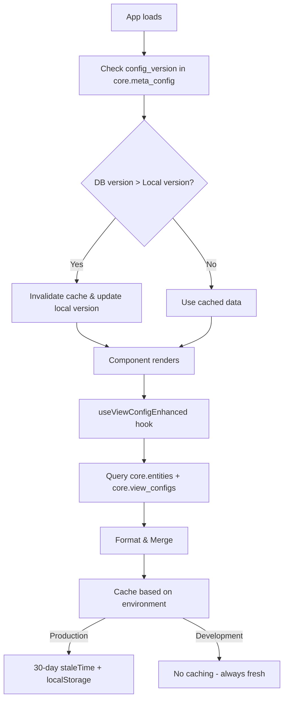
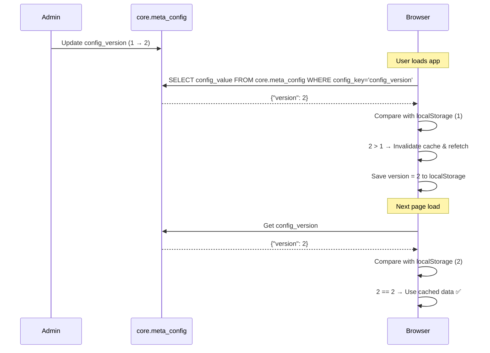

# Configuration Loading Strategy

> **Document Version:** 2.0  
> **Last Updated:** 2025-12-24  
> **Authors:** Engineering Team  
> **Status:** ✅ Implemented

---

## Executive Summary

This document outlines the definitive strategy for loading, caching, and invalidating entity and view configuration data in the DynamicViews module. It covers the architectural decision to deprecate local schema files in favor of a database-first approach with intelligent caching.

---

## Table of Contents

1. [Current State Analysis](#current-state-analysis)
2. [Architectural Decision: DB-First](#architectural-decision)
3. [Caching Strategy](#caching-strategy)
4. [Version-Based Cache Invalidation](#version-based-cache-invalidation)
5. [Lazy Loading Analysis](#lazy-loading-analysis)
6. [Implementation Status](#implementation-status)

---

## Current State Analysis

### Hooks After Cleanup

| Hook | File | Purpose | Status |
|------|------|---------|--------|
| `useViewConfigEnhanced` | [useEntityConfig.ts](file:///c:/Users/ganesh/zoworks/vite_tanstack_zoworks_v2/src/core/components/DynamicViews/hooks/useEntityConfig.ts) | Loads entity + view config | ✅ Active |
| `useFormConfig` | [useFormConfig.ts](file:///c:/Users/ganesh/zoworks/vite_tanstack_zoworks_v2/src/core/components/DynamicViews/hooks/useFormConfig.ts) | Form schema loading | ✅ Active |

### Data Flow (After Implementation)



---

## Architectural Decision

### Database-Only (No Local Files) ✅ Implemented

> [!IMPORTANT]
> The `src/schemas/` folder has been **deleted**. All configuration is now loaded from the database.

#### Why Database-Only?

| Factor | Local Files | Database + Cache |
|--------|-------------|------------------|
| **Multi-tenancy** | ❌ Same config for all | ✅ Per-org customization |
| **Hot Updates** | ❌ Needs deploy | ✅ Instant propagation |
| **Version Control** | ✅ Git history | ✅ DB audit trails |
| **Performance** | ✅ Bundled | ✅ 30-day cache + localStorage |
| **Scalability** | ❌ Build time imports | ✅ Dynamic loading |
| **Maintainability** | ❌ Two sources of truth | ✅ Single source |

---

## Caching Strategy

### Environment-Based Configuration

Located in [cacheConfig.ts](file:///c:/Users/ganesh/zoworks/vite_tanstack_zoworks_v2/src/core/lib/cacheConfig.ts):

```typescript
const CACHE_CONFIGS = {
  // Development: No caching, always fresh
  development: {
    staleTime: 0,
    gcTime: 0,
    persistMaxAge: 0,
  },
  
  // Production: 30-day cache with version-based invalidation
  production: {
    staleTime: 30 * 24 * 60 * 60 * 1000, // 30 days
    gcTime: 30 * 24 * 60 * 60 * 1000,    // 30 days
    persistMaxAge: 30 * 24 * 60 * 60 * 1000, // 30 days
  },
};
```

### When is each mode used?

| Mode | Condition |
|------|-----------|
| Development | `import.meta.env.DEV === true` OR `VITE_APP_ENV !== 'production'` |
| Production | `VITE_APP_ENV === 'production'` AND `import.meta.env.DEV === false` |

---

## Version-Based Cache Invalidation

### How It Works



### Database Table Schema

```sql
-- core.meta_config table structure
CREATE TABLE core.meta_config (
  config_key TEXT NOT NULL PRIMARY KEY,
  config_value JSONB NOT NULL,
  description TEXT NULL,
  updated_at TIMESTAMPTZ DEFAULT now()
);
```

### Setting Up the Version

```sql
-- Initial setup (run once)
INSERT INTO core.meta_config (config_key, config_value, description)
VALUES (
  'config_version',
  '{"version": 1}',
  'Config version number. Increment to invalidate all client caches.'
);
```

### Forcing Clients to Refresh

When you update `core.view_configs` or `core.entities`, run:

```sql
-- Increment version to force all clients to refetch
UPDATE core.meta_config 
SET config_value = jsonb_build_object('version', (config_value->>'version')::int + 1),
    updated_at = now()
WHERE config_key = 'config_version';
```

### Client-Side Logic

Located in [App.tsx](file:///c:/Users/ganesh/zoworks/vite_tanstack_zoworks_v2/src/App.tsx):

```typescript
const checkConfigVersion = async () => {
  if (isDevMode()) return; // Skip in development

  const { data } = await supabase
    .schema('core')
    .from('meta_config')
    .select('config_value')
    .eq('config_key', 'config_version')
    .single();

  const dbVersion = data?.config_value?.version || 1;
  const localVersion = parseInt(localStorage.getItem('zo_config_version') || '0');

  if (dbVersion > localVersion) {
    // Invalidate all config queries
    queryClient.invalidateQueries({ queryKey: ['viewConfigEnhanced'] });
    queryClient.invalidateQueries({ queryKey: ['FormConfig'] });
    localStorage.removeItem('QUERY_CACHE');
    localStorage.setItem('zo_config_version', dbVersion.toString());
  }
};
```

---

## Lazy Loading Analysis

### Current Behavior (Eager Loading) - **Kept**

All view configs are loaded together. This is intentional for V1.

### Recommendation: **NOT RECOMMENDED for V1**

> [!WARNING]
> **Keep current approach.** Lazy loading adds complexity:
> - More network requests (latency)
> - Complex cache invalidation
> - Extra state management
> - Marginal benefit (configs are ~5-15KB)

**When to reconsider:**
- View configs exceed 50KB per entity
- Entity count exceeds 50+
- Network latency becomes measurable issue

---

## Implementation Status

### ✅ Completed Changes

| File | Change |
|------|--------|
| `src/core/lib/cacheConfig.ts` | **Created** - Centralized cache config |
| `src/core/components/DynamicViews/hooks/useEntityConfig.ts` | **Updated** - Uses cache config, removed local fallback |
| `src/core/components/DynamicViews/hooks/useFormConfig.ts` | **Updated** - Fixed cache bug, uses cache config |
| `src/App.tsx` | **Updated** - Version-based invalidation, uses cache config |
| `src/core/components/DynamicViews/index.tsx` | **Updated** - Removed `testing` prop |

### ✅ Deleted Files

| File | Reason |
|------|--------|
| `src/core/components/DynamicViews/hooks/useEntityConfigNew.ts` | Duplicate |
| `src/core/components/DynamicViews/hooks/useConfigEnhanced.ts` | Legacy tables |
| `src/core/components/DynamicViews/hooks/useEntityViewConfig.ts` | Unused |
| `src/schemas/` (entire folder) | Migrated to DB-only |

---

## Appendix: Cache Configuration Reference

```typescript
// TanStack Query Cache Options

{
  staleTime: number,  // How long data is considered "fresh"
                      // During this time, no refetch on mount
                      
  gcTime: number,     // "Garbage Collection Time" - how long inactive 
                      // queries stay in memory
                      
  refetchOnMount: boolean,     // Refetch when component mounts
  refetchOnWindowFocus: boolean, // Refetch when tab gains focus
}

// localStorage Persistence (App.tsx)
{
  maxAge: number,     // How long persisted cache survives browser restart
}
```

### localStorage Keys Used

| Key | Purpose |
|-----|---------|
| `QUERY_CACHE` | TanStack Query persisted cache |
| `zo_config_version` | Last seen config version for this client |
