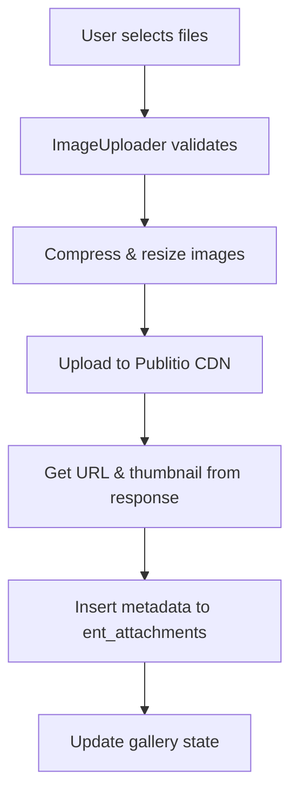
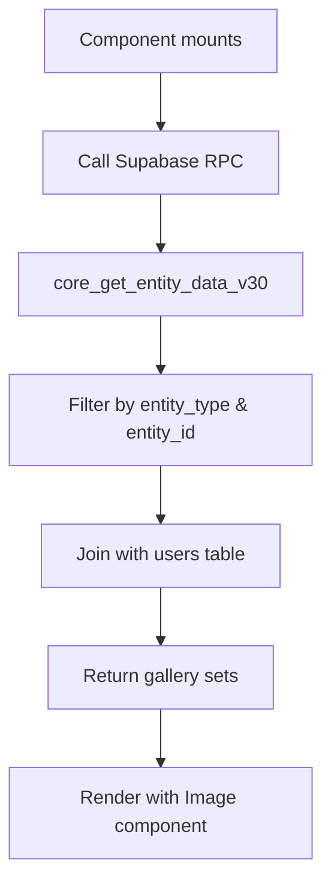

# Entity Images - Save & Fetch Flow

This document explains how the `EntityImages` component handles image saving and fetching.

---

## Overview

The system uses a **two-tier architecture**:
1. **File Storage**: [Publitio](https://publit.io/) cloud service for actual file hosting
2. **Metadata Storage**: Supabase `ent_attachments` table for tracking file references

---

## Saving Images

### Flow Diagram



### Key Steps

1. **File Selection** ([ImageUploader.tsx](file:///c:/Users/ganesh/zoworks/vite_tanstack_zoworks_v2/src/core/components/shared/ImageUploader.tsx))
   - User selects files via upload button or camera capture
   - Validates: max 10MB, allowed types (JPEG, PNG, GIF, PDF), max 10 files

2. **Image Compression** (lines 129-152)
   - Images are compressed and resized to max 800px width
   - Quality reduced to 70% via canvas

3. **Upload to Publitio** (lines 263-275)
   ```javascript
   const response = await publitio.uploadFile(compressedFile);
   // response contains: url_preview, url_thumbnail
   ```

4. **Save Metadata to Supabase** ([EntityImages.tsx](file:///c:/Users/ganesh/zoworks/vite_tanstack_zoworks_v2/src/core/components/details/EntityImages.tsx#L104-L143))
   ```javascript
   await supabase.from('ent_attachments').insert({
       entity_type,    // e.g., 'service', 'ticket'
       entity_id,      // ID of the parent entity
       images: files,  // Array of FileObject with URLs
       created_by: user.id
   });
   ```

### FileObject Structure

```typescript
interface FileObject {
    url: string;           // Full-size image URL from Publitio
    thumbnail?: string;    // Thumbnail URL for previews
    name: string;          // Original filename
    type: string;          // MIME type
    description: string;   // User-provided description
    created_at: string;    // Timestamp
    location?: { lat: number; lng: number };  // Geolocation if available
}
```

---

## Fetching Images

### Flow Diagram



### Fetch Query ([EntityImages.tsx](file:///c:/Users/ganesh/zoworks/vite_tanstack_zoworks_v2/src/core/components/details/EntityImages.tsx#L38-L101))

```javascript
const config = {
    entity_schema: 'public',
    entity_name: 'ent_attachments',
    organization_id: user?.organization_id,
    joins: [{
        schema: 'identity',
        name: 'users',
        alias: 'assignee',
        type: 'LEFT',
        on_clause: 'base.created_by = assignee.id'
    }],
    filters: [
        { column: 'entity_type', operator: '=', value: entity_type },
        { column: 'entity_id', operator: '=', value: entity_id }
    ],
    sorting: { column: 'created_at', direction: 'DESC' }
};

const { data } = await supabase.schema('core').rpc('core_get_entity_data_v30', { config });
```

### Gallery Display

- Images are grouped by upload batch (`GallerySet`)
- Each set shows: uploader name, timestamp, description, location
- Thumbnails shown in grid, full-size preview on click

---

## Deleting Images

Deletion removes the record from `ent_attachments` but **does NOT delete** the file from Publitio:

```javascript
await supabase.from('ent_attachments').delete().eq('id', fileToDelete.id);
```

> [!NOTE]
> Orphaned files remain on Publitio CDN. Manual cleanup may be needed.

---

## Database Schema

| Column | Type | Description |
|--------|------|-------------|
| `id` | UUID | Primary key |
| `entity_type` | TEXT | Parent entity type |
| `entity_id` | UUID | Parent entity ID |
| `images` | JSONB | Array of FileObject |
| `created_by` | UUID | User ID (FK to identity.users) |
| `created_at` | TIMESTAMP | Creation timestamp |
| `organization_id` | UUID | Tenant ID |
