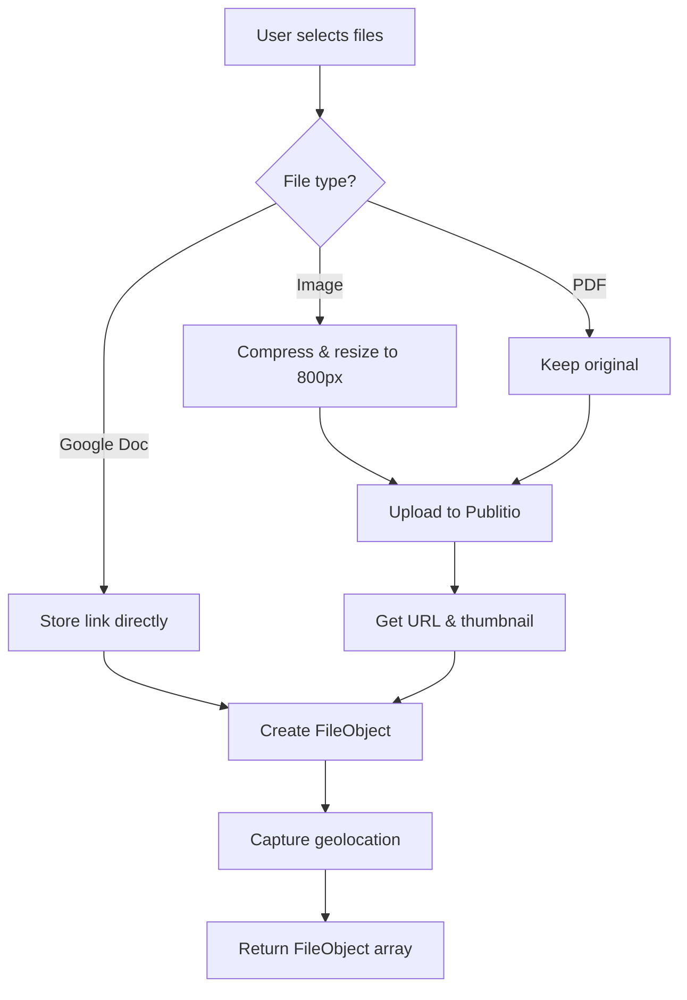

# Entity Images & File Attachments

> How images and files are uploaded, stored, and displayed in the platform.

---

## Architecture Overview

```
┌─────────────────────────────────────────────────────────────────┐
│                      CLIENT COMPONENTS                           │
├─────────────────────────────────────────────────────────────────┤
│  ImageUploader.tsx      │  EntityImages.tsx     │  FilesTab.tsx │
│  - Camera capture       │  - Gallery display    │  - Folder org │
│  - File selection       │  - CRUD operations    │  - Versioning │
│  - Compression          │  - Batch upload       │               │
│  - Google Doc links     │                       │               │
└─────────────────────────────────────────────────────────────────┘
                              ↓
┌─────────────────────────────────────────────────────────────────┐
│                      PUBLITIO CDN                                │
│  - File storage & hosting                                        │
│  - Auto-thumbnail generation                                     │
│  - URL preview & download                                        │
└─────────────────────────────────────────────────────────────────┘
                              ↓
┌─────────────────────────────────────────────────────────────────┐
│                      SUPABASE METADATA                           │
│  public.ent_attachments                                          │
│  - entity_type, entity_id                                        │
│  - images: JSONB array                                           │
│  - created_by, organization_id                                   │
└─────────────────────────────────────────────────────────────────┘
```

---

## File Structure

```
src/core/components/
├── shared/
│   └── ImageUploader.tsx       # Upload widget with compression
├── details/
│   ├── EntityImages.tsx        # Entity image gallery
│   └── FilesTab.tsx           # Folder-based file management
└── common/doc/
    └── SignatureWidget.tsx     # Signature capture & upload
```

---

## ImageUploader Component

**Location**: `src/core/components/shared/ImageUploader.tsx`

### Features

| Feature | Description |
|---------|-------------|
| Camera Capture | Mobile camera access via `input.capture` |
| File Selection | Drag-drop or click to select |
| Image Compression | Resize to 800px width, 70% quality |
| Google Doc Links | External link attachments |
| Geolocation | Captures lat/lng on upload |
| Batch Description | Single description for all files |

### Configuration

```typescript
const uploadConfig = {
  maxFileSize: 10,  // 10MB
  allowedTypes: ['image/jpeg', 'image/png', 'image/gif', 'application/pdf'],
  maxFileNameLength: 100,
  maxFiles: 10,
};
```

### Props

```typescript
interface ImageUploaderProps {
  onUploadComplete: (files: FileObject[]) => void;
  maxFiles?: number;
  allowedTypes?: string[];
  autoUpload?: boolean;  // If false, manual trigger via ref
}

interface ImageUploaderRef {
  triggerUpload: () => Promise<FileObject[]>;
}
```

### FileObject Structure

```typescript
interface FileObject {
  url: string;           // Full-size URL from Publitio
  thumbnail?: string;    // Thumbnail URL (images only)
  name: string;          // Original filename
  type: string;          // MIME type or 'google-doc'
  description: string;   // User-provided batch description
  created_at: string;    // ISO timestamp
  location?: {           // Geolocation if available
    lat: number;
    lng: number;
  };
}
```

### Image Compression

```typescript
// Resize to 800px width, maintain aspect ratio, 70% quality
const compressAndResizeImage = (file: File, maxWidth = 800): Promise<File> => {
  return new Promise((resolve, reject) => {
    const img = new Image();
    const reader = new FileReader();
    reader.readAsDataURL(file);
    reader.onload = (e) => (img.src = e.target!.result as string);
    img.onload = () => {
      const canvas = document.createElement('canvas');
      const ctx = canvas.getContext('2d')!;
      const aspectRatio = img.height / img.width;
      canvas.width = maxWidth;
      canvas.height = maxWidth * aspectRatio;
      ctx.drawImage(img, 0, 0, maxWidth, maxWidth * aspectRatio);
      canvas.toBlob(
        (blob) => resolve(new File([blob!], file.name, { type: file.type })),
        file.type,
        0.7  // 70% quality
      );
    };
  });
};
```

### Publitio Upload

```typescript
import Publitio from 'publitio_js_sdk';

const publitio = new Publitio(
  import.meta.env.VITE_PUBLITIO_API_KEY,
  import.meta.env.VITE_PUBLITIO_API_SECRET
);

// Upload compressed file
const response = await publitio.uploadFile(compressedFile);
// response contains: url_preview, url_thumbnail, url_download
```

### Upload Flow



---

## EntityImages Component

**Location**: `src/core/components/details/EntityImages.tsx`

### Purpose
Displays image gallery for any entity (tickets, services, etc.) with upload and delete capabilities.

### Props

```typescript
interface EntityImagesProps {
  entity_type: string;  // e.g., 'tickets', 'services'
  entity_id: string;    // UUID of the parent entity
}
```

### Fetching Images

```typescript
const config = {
  entity_schema: 'public',
  entity_name: 'ent_attachments',
  organization_id: user?.organization_id,
  joins: [{
    schema: 'identity',
    name: 'users',
    alias: 'assignee',
    type: 'LEFT',
    on_clause: 'base.created_by = assignee.id'
  }],
  filters: [
    { column: 'entity_type', operator: '=', value: entity_type },
    { column: 'entity_id', operator: '=', value: entity_id }
  ],
  sorting: { column: 'created_at', direction: 'DESC' }
};

const { data } = await supabase.schema('core').rpc('core_get_entity_data_v30', { config });
```

### Saving Images

```typescript
const handleFilesUploaded = async (files: FileObject[]) => {
  const { data, error } = await supabase
    .from('ent_attachments')
    .insert({
      entity_type,
      entity_id,
      images: files,  // JSONB array
      created_by: user.id,
    })
    .select();
};
```

### Gallery Display

```typescript
interface GallerySet {
  id: string;
  files: FileObject[];
  created_by: string;
  created_by_name: string;
}
```

**Responsive Grid:**
- `xs={24}` — Full width on mobile
- `md={12}` — 2 columns on tablet
- `lg={8}` — 3 columns on desktop

### Deletion

```typescript
const confirmDelete = async () => {
  await supabase
    .from('ent_attachments')
    .delete()
    .eq('id', fileToDelete.id);
};
```

> [!WARNING]
> Deleting from `ent_attachments` does NOT delete files from Publitio CDN.
> Orphaned files may need manual cleanup.

---

## FilesTab Component

**Location**: `src/core/components/details/FilesTab.tsx`

### Purpose
Folder-organized file management with versioning support. Used for project documentation.

### Features

| Feature | Description |
|---------|-------------|
| Folder Creation | User-defined folder structure |
| Per-Folder Upload | Files organized by folder |
| Versioning | Track file versions |
| Stage Tracking | Draft, Review, Final |

### Storage Pattern

Files stored in JSONB `details.files` column:

```json
{
  "details": {
    "files": {
      "Documents": [
        {
          "id": "...",
          "name": "contract.pdf",
          "url_preview": "...",
          "url_download": "...",
          "uploadedBy": "User Name",
          "uploadedAt": "2025-12-25T...",
          "version": "1.0",
          "stage": "Draft"
        }
      ],
      "Images": [...]
    }
  }
}
```

---

## Environment Variables

```bash
# .env
VITE_PUBLITIO_API_KEY=your_api_key
VITE_PUBLITIO_API_SECRET=your_api_secret
```

---

## Database Schema

### ent_attachments Table

| Column | Type | Description |
|--------|------|-------------|
| `id` | UUID | Primary key |
| `entity_type` | TEXT | Parent entity type (e.g., 'tickets') |
| `entity_id` | UUID | Parent entity ID |
| `images` | JSONB | Array of FileObject |
| `created_by` | UUID | User ID (FK to identity.users) |
| `created_at` | TIMESTAMP | Creation timestamp |
| `organization_id` | UUID | Tenant ID |

### Query Patterns

```sql
-- Fetch attachments for an entity
SELECT ea.*, u.name as created_by_name
FROM ent_attachments ea
LEFT JOIN identity.users u ON ea.created_by = u.id
WHERE ea.entity_type = 'tickets'
  AND ea.entity_id = 'uuid-here'
ORDER BY ea.created_at DESC;
```

---

## Usage Examples

### Basic Image Gallery

```tsx
import EntityImages from '@/core/components/details/EntityImages';

const TicketDetails = ({ ticket }) => (
  <EntityImages
    entity_type="tickets"
    entity_id={ticket.id}
  />
);
```

### Custom Upload Handler

```tsx
import ImageUploader from '@/core/components/shared/ImageUploader';

const MyComponent = () => {
  const handleUpload = async (files: FileObject[]) => {
    // Custom logic (e.g., save to different table)
    await supabase.from('my_table').insert({
      attachments: files
    });
  };

  return (
    <ImageUploader
      onUploadComplete={handleUpload}
      maxFiles={5}
      allowedTypes={['image/jpeg', 'image/png']}
    />
  );
};
```

### Manual Upload Trigger (via ref)

```tsx
import { useRef } from 'react';
import ImageUploader, { ImageUploaderRef } from '@/core/components/shared/ImageUploader';

const MyForm = () => {
  const uploaderRef = useRef<ImageUploaderRef>(null);

  const handleSubmit = async () => {
    const files = await uploaderRef.current?.triggerUpload();
    // Use files in form submission
  };

  return (
    <>
      <ImageUploader ref={uploaderRef} autoUpload={false} onUploadComplete={() => {}} />
      <Button onClick={handleSubmit}>Submit</Button>
    </>
  );
};
```

---

## Implementation Checklist

- [x] Publitio SDK integration
- [x] Image compression (800px, 70% quality)
- [x] Camera capture on mobile
- [x] Google Doc link attachments
- [x] Geolocation capture
- [x] Responsive gallery grid
- [x] Batch descriptions
- [x] Delete confirmation modal
- [x] RPC-based fetching with joins

---

*Last Updated: 2025-12-25*
*Source: `src/core/components/shared/ImageUploader.tsx`, `src/core/components/details/EntityImages.tsx`*
