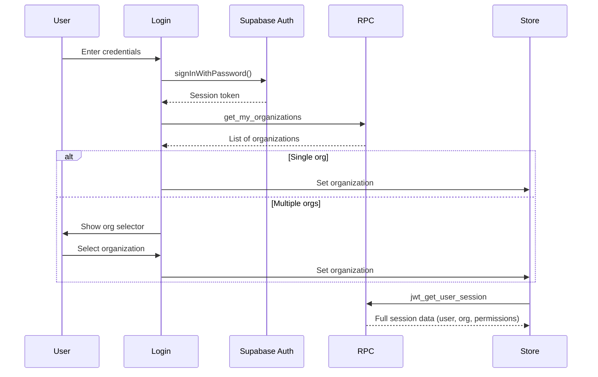
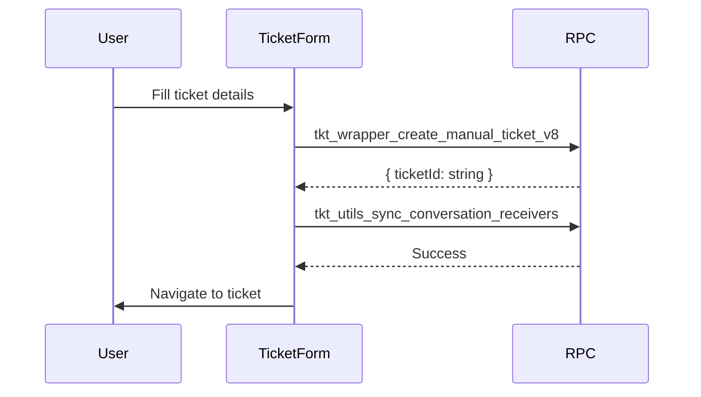

# RPC Interaction Flow Documentation

> **Auto-generated from source code analysis** - January 6, 2026  
> This document lists all RPC (Remote Procedure Calls) used in the application, organized by user interaction flow from login through navigation.

---

## Table of Contents

1. [Authentication & Session Management](#1-authentication--session-management)
2. [Organization Switching](#2-organization-switching)
3. [Dashboard](#3-dashboard)
4. [Dynamic Views (Core Entity Operations)](#4-dynamic-views-core-entity-operations)
5. [Tickets Module](#5-tickets-module)
6. [WhatsApp Module](#6-whatsapp-module)
7. [Workforce Module](#7-workforce-module)
8. [Admin Settings](#8-admin-settings)
9. [Metadata & Configuration](#9-metadata--configuration)
10. [Field Service & Reports](#10-field-service--reports)

---

## 1. Authentication & Session Management

### Login Flow

| RPC Name | Schema | File | Description |
|----------|--------|------|-------------|
| `get_my_organizations` | `identity` | [Login.tsx](file:///c:/Users/ganesh/zoworks/vite_tanstack_zoworks_v2/src/pages/auth/Login.tsx#L148) | After successful login, fetches list of organizations the user belongs to |
NOT IMPLEMENTED IN BACKEND -> | `auth_user_rollback` | `public` | [WebRegister.tsx](file:///c:/Users/ganesh/zoworks/vite_tanstack_zoworks_v2/src/pages/auth/WebRegister.tsx#L164) | Rollback user creation if registration fails |

### Session Hydration

| RPC Name | Schema | File | Description |
|----------|--------|------|-------------|
| `jwt_get_user_session` | `identity` | [useUserSession.ts](file:///c:/Users/ganesh/zoworks/vite_tanstack_zoworks_v2/src/core/hooks/useUserSession.ts#L562) | Core session RPC - fetches user ID, org ID, roles, permissions, location from JWT |

**Flow:**


---

## 2. Organization Switching

| RPC Name | Schema | File | Description |
|----------|--------|------|-------------|
| `get_my_organizations` | `identity` | [Header/index.tsx](file:///c:/Users/ganesh/zoworks/vite_tanstack_zoworks_v2/src/core/components/Layout/Header/index.tsx#L72) | Fetch organizations for org switcher dropdown |
| `set_preferred_organization` | `identity` | [Header/index.tsx](file:///c:/Users/ganesh/zoworks/vite_tanstack_zoworks_v2/src/core/components/Layout/Header/index.tsx#L126) | Sets the user's preferred organization (persisted on backend) |

**Also used in:**
- [Settings/index.tsx](file:///c:/Users/ganesh/zoworks/vite_tanstack_zoworks_v2/src/core/components/Layout/Settings/index.tsx#L66-L100)

---

## 3. Dashboard

| RPC Name | Schema | File | Description |
|----------|--------|------|-------------|
| `fn_get_or_calc_metric_data_v4` | `analytics` | [Dashboard.tsx](file:///c:/Users/ganesh/zoworks/vite_tanstack_zoworks_v2/src/pages/Dashboard.tsx#L74) | Fetches or calculates metric data for dashboard widgets |
| `core_get_user_dashboard_v2` | `analytics` | [DashboardView.tsx](file:///c:/Users/ganesh/zoworks/vite_tanstack_zoworks_v2/src/core/components/DynamicViews/DashboardView.tsx#L51) | Gets user's saved dashboard configuration |
| `core_save_user_dashboard_v2` | `analytics` | [DashboardView.tsx](file:///c:/Users/ganesh/zoworks/vite_tanstack_zoworks_v2/src/core/components/DynamicViews/DashboardView.tsx#L162) | Saves user's dashboard layout and widget configuration |

**Parameters for `fn_get_or_calc_metric_data_v4`:**
```typescript
{
  p_view_name: string,    // Entity type for the widget
  p_org_id: string,       // Organization ID
  p_loc_id?: string,      // Optional location ID
  p_force_refresh: boolean // Force recalculation
}
```

---

## 4. Dynamic Views (Core Entity Operations)

These RPCs power the generic entity viewing/editing system used across CRM, Tickets, and other modules.

### Data Fetching

| RPC Name | Schema | File | Description |
|----------|--------|------|-------------|
| `api_fetch_entity_records` | `core` | [DynamicViews/index.tsx](file:///c:/Users/ganesh/zoworks/vite_tanstack_zoworks_v2/src/core/components/DynamicViews/index.tsx#L1088) | Main RPC for fetching entity list data with filters, sorting, pagination |
| `api_fetch_entity_detail` | `core` | [DetailOverview.tsx](file:///c:/Users/ganesh/zoworks/vite_tanstack_zoworks_v2/src/core/components/details/DetailOverview.tsx#L244) | Fetches single entity details for detail drawer |
| `core_get_entity_data_v30` | `core` | [EntityImages.tsx](file:///c:/Users/ganesh/zoworks/vite_tanstack_zoworks_v2/src/core/components/details/EntityImages.tsx#L74) | Entity data with images |
| `core_get_entity_data_with_joins_v2` | `public` | [Messages.tsx](file:///c:/Users/ganesh/zoworks/vite_tanstack_zoworks_v2/src/modules/tickets/components/Messages.tsx#L531) | Entity data with related table joins |

### Data Mutation

| RPC Name | Schema | File | Description |
|----------|--------|------|-------------|
| `core_upsert_data_v8` | `core` | [RowActions.tsx](file:///c:/Users/ganesh/zoworks/vite_tanstack_zoworks_v2/src/core/components/DynamicViews/RowActions.tsx#L113) | Insert or update entity records |
| `core_upsert_data_v8` | `core` | [KanbanView.tsx](file:///c:/Users/ganesh/zoworks/vite_tanstack_zoworks_v2/src/core/components/DynamicViews/KanbanView.tsx#L349) | Update record when dragging cards in Kanban |
| `core_upsert_data_v8` | `core` | [GlobalActions.tsx](file:///c:/Users/ganesh/zoworks/vite_tanstack_zoworks_v2/src/core/components/DynamicViews/GlobalActions.tsx#L84) | Bulk global actions on entities |
| `core_bulk_upsert_data` | `public` | [BulkUpload.tsx](file:///c:/Users/ganesh/zoworks/vite_tanstack_zoworks_v2/src/core/components/DynamicViews/BulkUpload.tsx#L531) | Bulk import data from CSV/Excel |

### Metrics & Analytics

| RPC Name | Schema | File | Description |
|----------|--------|------|-------------|
| `core_calculate_entity_metricv9` | `public` | [MetricsView.tsx](file:///c:/Users/ganesh/zoworks/vite_tanstack_zoworks_v2/src/core/components/DynamicViews/MetricsView.tsx#L89) | Calculate metrics for entity views |
| `core_calculate_entity_metricv9` | `public` | [MetricChartWidget.tsx](file:///c:/Users/ganesh/zoworks/vite_tanstack_zoworks_v2/src/core/components/DynamicViews/MetricChartWidget.tsx#L65) | Calculate metrics for chart widgets |

### Approvals

| RPC Name | Schema | File | Description |
|----------|--------|------|-------------|
| `get_all_approvers` | `identity` | [ApprovalActionButtons.tsx](file:///c:/Users/ganesh/zoworks/vite_tanstack_zoworks_v2/src/core/components/details/ApprovalActionButtons.tsx#L59) | Get list of eligible approvers for an entity |

---

## 5. Tickets Module

| RPC Name | Schema | File | Description |
|----------|--------|------|-------------|
| `tkt_wrapper_create_manual_ticket_v8` | `organization` | [TicketForm.tsx](file:///c:/Users/ganesh/zoworks/vite_tanstack_zoworks_v2/src/modules/tickets/components/TicketForm.tsx#L533) | Create a new ticket with all metadata |
| `tkt_wrapper_create_qr_ticket_v5` | `public` | [QrTicketForm.tsx](file:///c:/Users/ganesh/zoworks/vite_tanstack_zoworks_v2/src/modules/tickets/components/QrTicketForm.tsx#L46) | Create ticket from QR code scan (public form) |
| `tkt_add_reply_to_conversation` | `public` | [Messages.tsx](file:///c:/Users/ganesh/zoworks/vite_tanstack_zoworks_v2/src/modules/tickets/components/Messages.tsx#L613) | Add a reply message to ticket conversation |
| `tkt_utils_sync_conversation_receivers` | `public` | [TicketForm.tsx](file:///c:/Users/ganesh/zoworks/vite_tanstack_zoworks_v2/src/modules/tickets/components/TicketForm.tsx#L593) | Sync conversation recipients after ticket creation |
| `get_automation_logs_v4` | `automation` | [AutomationLogViewer.tsx](file:///c:/Users/ganesh/zoworks/vite_tanstack_zoworks_v2/src/modules/tickets/components/AutomationLogViewer.tsx#L356) | View automation/workflow execution logs for a ticket |

**Ticket Creation Flow:**


---

## 6. WhatsApp Module

| RPC Name | Schema | File | Description |
|----------|--------|------|-------------|
| `wa_close_conversation` | `public` | [useConversationActions.ts](file:///c:/Users/ganesh/zoworks/vite_tanstack_zoworks_v2/src/modules/wa/hooks/useConversationActions.ts#L20) | Close/resolve a WhatsApp conversation |
| `wa_assign_agent` | `public` | [useConversationActions.ts](file:///c:/Users/ganesh/zoworks/vite_tanstack_zoworks_v2/src/modules/wa/hooks/useConversationActions.ts#L76) | Assign agent to handle a conversation |
| `wa_update_contact_tags` | `public` | [useContactDetails.ts](file:///c:/Users/ganesh/zoworks/vite_tanstack_zoworks_v2/src/modules/wa/hooks/useContactDetails.ts#L179) | Update tags on a WhatsApp contact |

---

## 7. Workforce Module

### Timesheets

| RPC Name | Schema | File | Description |
|----------|--------|------|-------------|
| `get_projects_for_user` | `public` | [Timesheet.tsx](file:///c:/Users/ganesh/zoworks/vite_tanstack_zoworks_v2/src/modules/workforce/components/Timesheet.tsx#L631) | Get list of projects assigned to user for timesheet entries |
| `get_projects_for_user` | `public` | [TimesheetProjects.tsx](file:///c:/Users/ganesh/zoworks/vite_tanstack_zoworks_v2/src/modules/workforce/components/TimesheetProjects.tsx#L849) | Same RPC used in projects view |

### Expenses

| RPC Name | Schema | File | Description |
|----------|--------|------|-------------|
| `get_projects_with_allocation_v3` | `public` | [Expensesheet.tsx](file:///c:/Users/ganesh/zoworks/vite_tanstack_zoworks_v2/src/modules/workforce/components/Expensesheet.tsx#L58) | Get projects with budget allocation info for expense entries |

### Field Agents / Maps

| RPC Name | Schema | File | Description |
|----------|--------|------|-------------|
| `maps_get_clients_with_wkt` | `public` | [AgentActivityReport.tsx](file:///c:/Users/ganesh/zoworks/vite_tanstack_zoworks_v2/src/modules/workforce/components/AgentActivityReport.tsx#L174) | Get client locations with WKT (Well-Known Text) geometry for map display |

---

## 8. Admin Settings

### Enums & Types

| RPC Name | Schema | File | Description |
|----------|--------|------|-------------|
| `get_enums` | `public` | [EnumManager.tsx](file:///c:/Users/ganesh/zoworks/vite_tanstack_zoworks_v2/src/modules/admin/pages/Settings/EnumManager.tsx#L86) | Get all enum types for configuration |
| `update_enum_type` | `public` | [EnumManager.tsx](file:///c:/Users/ganesh/zoworks/vite_tanstack_zoworks_v2/src/modules/admin/pages/Settings/EnumManager.tsx#L118) | Add/remove values from an enum type |

### Leave Settings

| RPC Name | Schema | File | Description |
|----------|--------|------|-------------|
| `get_project_details_with_project_users_v2` | `public` | [LeaveSettings.tsx](file:///c:/Users/ganesh/zoworks/vite_tanstack_zoworks_v2/src/modules/admin/pages/Settings/LeaveSettings.tsx#L159) | Get project details with assigned users for leave allocation |

---

## 9. Metadata & Configuration

These RPCs are used in the Settings Configuration module for managing entity metadata and views.

| RPC Name | Schema | File | Description |
|----------|--------|------|-------------|
| `met_scan_schema_columns` | `core` | [Metadata.tsx](file:///c:/Users/ganesh/zoworks/vite_tanstack_zoworks_v2/src/modules/settings/pages/Config/Metadata.tsx#L158) | Scan database schema to get available columns |
| `met_save_schema_draft` | `core` | [Metadata.tsx](file:///c:/Users/ganesh/zoworks/vite_tanstack_zoworks_v2/src/modules/settings/pages/Config/Metadata.tsx#L389) | Save entity metadata as draft |
| `met_entity_get_capabilities` | `core` | [ViewConfigEditor.tsx](file:///c:/Users/ganesh/zoworks/vite_tanstack_zoworks_v2/src/modules/settings/pages/Config/ViewConfigEditor.tsx#L41) | Get entity capabilities (filters, sorts, etc.) |
| `view_suggest_configs` | `core` | [YViewConfigManager.tsx](file:///c:/Users/ganesh/zoworks/vite_tanstack_zoworks_v2/src/modules/settings/pages/Config/YViewConfigManager.tsx#L257) | AI-assisted view configuration suggestions |
| `entity_metadata_save` | `core` | [MetadataV.tsx](file:///c:/Users/ganesh/zoworks/vite_tanstack_zoworks_v2/src/modules/settings/pages/Config/MetadataV.tsx#L300) | Save entity metadata configuration |
| `met_publish_schema_version` | `core` | [EntityVersionManager.tsx](file:///c:/Users/ganesh/zoworks/vite_tanstack_zoworks_v2/src/modules/settings/pages/Config/EntityVersionManager.tsx#L81) | Publish a schema version |
| `met_provision_entity` | `core` | [EntityVersionManager.tsx](file:///c:/Users/ganesh/zoworks/vite_tanstack_zoworks_v2/src/modules/settings/pages/Config/EntityVersionManager.tsx#L106) | Provision a new entity in the database |

---

## 10. Field Service & Reports

| RPC Name | Schema | File | Description |
|----------|--------|------|-------------|
| `prepopulate_service_report_v2` | `public` | [TaskReportPage.tsx](file:///c:/Users/ganesh/zoworks/vite_tanstack_zoworks_v2/src/core/components/common/doc/TaskReportPage.tsx#L236) | Pre-populate service report based on task data |
| `upsert_service_report_and_task_v2` | `organization` | [TaskReportPage.tsx](file:///c:/Users/ganesh/zoworks/vite_tanstack_zoworks_v2/src/core/components/common/doc/TaskReportPage.tsx#L497) | Save service report and update task status |

---

## RPC Summary by Schema

| Schema | Count | RPCs |
|--------|-------|------|
| `identity` | 4 | `get_my_organizations`, `jwt_get_user_session`, `set_preferred_organization`, `get_all_approvers` |
| `core` | 7 | `api_fetch_entity_records`, `api_fetch_entity_detail`, `met_*`, `view_suggest_configs` |
| `analytics` | 2 | `fn_get_or_calc_metric_data_v4`, `core_upsert_data_v8` |
| `organization` | 2 | `tkt_wrapper_create_manual_ticket_v8`, `upsert_service_report_and_task_v2` |
| `automation` | 1 | `get_automation_logs_v4` |
| `public` | 15+ | Most utility RPCs (workforce, tickets, enums, maps) |

---

## Navigation Flow Summary

```
┌─────────────────────────────────────────────────────────────────────────┐
│                           USER OPENS APP                                 │
└─────────────────────────────────────────────────────────────────────────┘
                                    │
                                    ▼
┌─────────────────────────────────────────────────────────────────────────┐
│  LOGIN PAGE                                                              │
│  • Supabase Auth: signInWithPassword()                                   │
│  • RPC: get_my_organizations                                             │
│  • Store selection → RPC: jwt_get_user_session                           │
└─────────────────────────────────────────────────────────────────────────┘
                                    │
                                    ▼
┌─────────────────────────────────────────────────────────────────────────┐
│  DASHBOARD (/dashboard)                                                  │
│  • RPC: fn_get_or_calc_metric_data_v4 (per widget)                       │
│  • RPC: core_get_user_dashboard_v2                                       │
└─────────────────────────────────────────────────────────────────────────┘
                                    │
        ┌───────────────────────────┼───────────────────────────┐
        ▼                           ▼                           ▼
┌─────────────────┐      ┌─────────────────┐      ┌─────────────────────┐
│  CRM/CONTACTS   │      │    TICKETS      │      │     WORKFORCE       │
│  (/crm/contacts)│      │ (/support/      │      │ (/workforce/*)      │
│                 │      │  tickets)       │      │                     │
│ • api_fetch_    │      │ • api_fetch_    │      │ • get_projects_     │
│   entity_records│      │   entity_records│      │   for_user          │
│ • core_upsert_  │      │ • tkt_wrapper_  │      │ • get_projects_     │
│   data_v8       │      │   create_*      │      │   with_allocation   │
│                 │      │ • tkt_add_reply │      │ • maps_get_clients  │
└─────────────────┘      └─────────────────┘      └─────────────────────┘
        │                           │                           │
        └───────────────────────────┼───────────────────────────┘
                                    ▼
┌─────────────────────────────────────────────────────────────────────────┐
│  HEADER ORG SWITCHER (any page)                                          │
│  • RPC: get_my_organizations                                             │
│  • RPC: set_preferred_organization                                       │
│  • Triggers: jwt_get_user_session refresh                                │
└─────────────────────────────────────────────────────────────────────────┘
```

---

## Notes

1. **Schema Prefixes**: Most RPCs use `.schema('identity')` or `.schema('core')` prefix. Public schema RPCs use direct `.rpc()` calls.

2. **Deprecated RPCs**: Several commented-out RPCs exist with `_DEPRECATED` suffix - these have been replaced by newer versions.

3. **Versioning**: Many RPCs have version suffixes (e.g., `v2`, `v8`) indicating iterative improvements.

4. **Error Handling**: All RPC calls should check for `error` in the destructured response and handle appropriately.