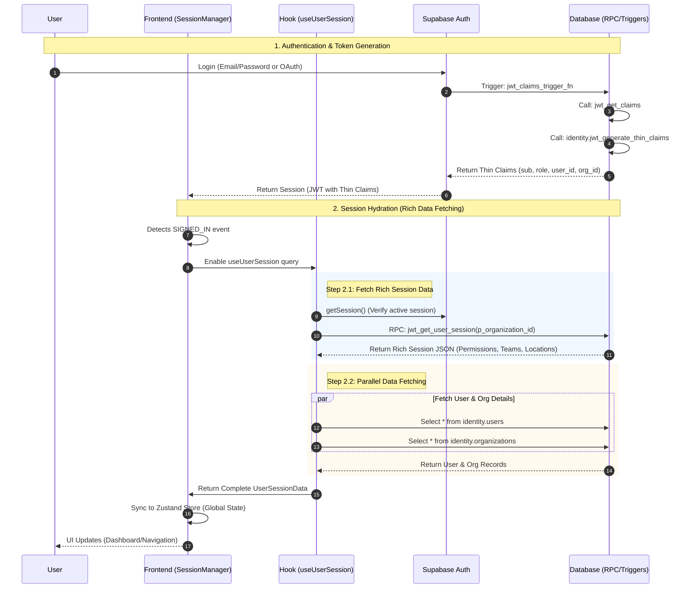

# Authentication & Session Flow

This document details the end-to-end authentication flow, from the initial Supabase Auth trigger to the frontend session hydration.

## Overview

The application uses a **"Thin JWT, Rich Session"** architecture.
1.  **Thin JWT**: The standard Supabase JWT contains minimal claims (User ID, Org ID, Role). This ensures the token remains small and performant.
2.  **Rich Session**: The frontend immediately "hydrates" the session by calling a specialized RPC (`jwt_get_user_session`). This RPC returns the full, complex hierarchy of permissions, teams, and locations that would be too large for a JWT.

## Sequence Diagram

The following diagram illustrates the complete flow:



## Data Structures

### 1. Thin JWT Claims (Backend Generated)
Generated by `identity.jwt_generate_thin_claims` and embedded in the Supabase Auth Token.
```json
{
  "sub": "auth-user-uuid-...",
  "role": "authenticated",
  "user_id": "core-user-uuid-...",
  "org_id": "org-uuid-..."
}
```

### 2. Rich Session Object (RPC Response)
Returned by `jwt_get_user_session` and used to hydrate the frontend state.
```json
{
  "user_id": "a0eebc99-9c0b-4ef8-bb6d-6bb9bd380a11",
  "org_user_id": "b1f0c999-9c0b-4ef8-bb6d-6bb9bd380a22",
  "org_id": "c2d0c999-9c0b-4ef8-bb6d-6bb9bd380a33",
  "is_saas_admin": false,
  "roles": [
    {
      "id": "d3e0c999-9c0b-4ef8-bb6d-6bb9bd380a44",
      "name": "Manager"
    }
  ],
  "permissions": {
    "tickets": { "view": true, "edit": true, "delete": false },
    "users": { "view": true }
  },
  "teams": [
    { "id": "...", "name": "Support Team" }
  ],
  "locations": [
    { "id": "...", "name": "New York Office" }
  ],
  "subordinates": [
    "g6h0c999-9c0b-4ef8-bb6d-6bb9bd380a77"
  ]
}
```

## Key Components

| Component | Type | Responsibility |
| :--- | :--- | :--- |
| `SessionManager.tsx` | Headless Component | Listens to Auth events and orchestrates the hydration process. Syncs data to Zustand. |
| `useUserSession.ts` | React Query Hook | Performs the actual data fetching: calls the RPC and fetches related User/Org records in parallel. |
| `jwt_claims_trigger_fn` | Database Trigger | Fires on auth events to inject custom claims into the JWT. |
| `jwt_get_user_session` | Database RPC | The primary API endpoint for fetching the complex, hierarchical session data. |
