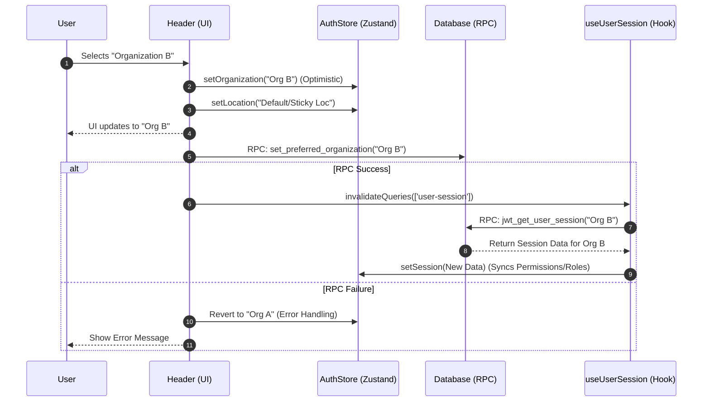
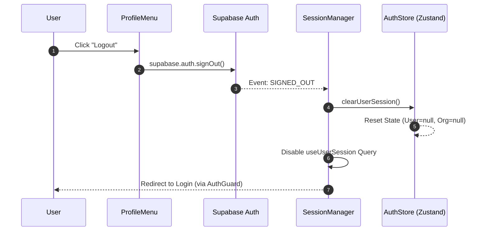

# Organization Switching & Logout Flow

This document details the processes for switching organizations and logging out of the application.

## Organization Switching

The application allows users to switch between different organizations they belong to. This process involves optimistic UI updates, database persistence, and session re-fetching.

### Flow Overview

1.  **User Action**: User selects a new organization from the dropdown in the `Header` component.
2.  **Optimistic Update**:
    *   The `useAuthStore` is immediately updated with the new Organization ID and Name.
    *   The UI reflects the change instantly (e.g., showing the new org name).
    *   A "sticky" location (last visited for that org) or a default location is selected and updated in the store.
3.  **Persistence**:
    *   The client calls the RPC `set_preferred_organization` with the `new_org_id`.
    *   This updates the user's profile in the database, ensuring that the next time they log in, they default to this organization.
4.  **Session Re-fetch (Invalidation)**:
    *   The `user-session` query key in `useUserSession` includes the `currentOrgId`.
    *   The `Header` component triggers `queryClient.invalidateQueries({ queryKey: ['user-session'] })`.
    *   **Crucially**, because the Store's Org ID has changed (step 2), the `useUserSession` hook (which observes the store) detects a change in its query key (or is forced to re-run).
    *   The hook fetches the *new* session data (permissions, roles, etc.) for the selected organization.

### Sequence Diagram

## Logout Flow

Logging out ensures that the user's session is securely terminated both locally and on the server.

### Flow Overview

1.  **User Action**: User clicks "Logout" in the `ProfileMenu`.
2.  **Supabase SignOut**: The client calls `supabase.auth.signOut()`.
3.  **Event Detection**:
    *   The `SessionManager` component listens for the `SIGNED_OUT` event from Supabase.
4.  **State Cleanup**:
    *   `SessionManager` calls `clearUserSession()` in the `useAuthStore`.
    *   This resets `user`, `organization`, `permissions`, etc., to `null`.
    *   The `initialized` flag is set to `true` (indicating the app is ready but no user is logged in).
5.  **Query Disable**:
    *   `SessionManager` disables the `useUserSession` query to prevent further network requests.

### Sequence Diagram

