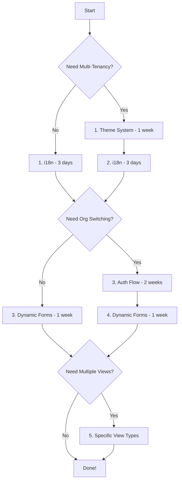

# Reverse Migration Analysis

## Bringing Enterprise Features from vite_tanstack_zoworks_v2 → adaptive-ai-crm

**Assessment Date:** January 21, 2026  
**Purpose:** Evaluate feasibility of migrating enterprise features into the simpler adaptive-ai-crm project

---

## 🎯 Executive Summary

| Feature | Difficulty | Risk | Value | Recommendation |
|---------|-----------|------|-------|----------------|
| **Auth Flow** | 🔴 **HARD** | HIGH | ⭐⭐⭐⭐⭐ | Worth it, but major refactor |
| **Theme System** | 🟡 **MEDIUM** | MEDIUM | ⭐⭐⭐⭐⭐ | Highly recommended |
| **i18n (Multi-language)** | 🟢 **EASY** | LOW | ⭐⭐⭐⭐ | Easy win |
| **Dynamic Views** | 🔴 **HARD** | HIGH | ⭐⭐⭐⭐ | Complex, partial adoption better |
| **Dynamic Forms (RJSF)** | 🟡 **MEDIUM** | MEDIUM | ⭐⭐⭐⭐⭐ | Recommended with caution |
| **Antd + shadcn Mix** | 🟢 **EASY** | LOW | ⭐⭐⭐ | Feasible but not critical |

**Overall Verdict:** **SELECTIVE MIGRATION** - Take i18n and theme system first, auth flow if needed, forms if beneficial. Skip full DynamicViews (too complex).

---

## 1. 🔐 Auth Flow Migration

### What It Is
Complex multi-step authentication system with:
- Supabase auth integration
- RPC-based session hydration (`jwt_get_user_session`)
- Organization/location switching
- TanStack Query caching
- Zustand state management
- SessionManager orchestration

### Current Implementation Complexity

**File:** `vite_tanstack_zoworks_v2/src/core/hooks/useUserSession.ts` (652 lines!)

```typescript
// 6-step session hydration process:
// 1. Validate Supabase session
// 2. Call RPC with org_id
// 3. Fetch user record
// 4. Fetch organization record
// 5. Fetch location (optional)
// 6. Combine into session object
```

**Dependencies:**
- `@tanstack/react-query` - Query caching
- Zustand store - `useAuthStore`
- Custom RPC: `identity.jwt_get_user_session`
- Database tables: `identity.users`, `identity.organizations`, `identity.locations`

---

### Migration Difficulty: 🔴 **HARD** (8/10)

**Why Hard:**

1. **Database Schema Required**
   ```sql
   -- Need to create these tables in adaptive-ai-crm
   identity.users
   identity.organizations
   identity.organization_users
   identity.locations
   
   -- Plus RPC function
   CREATE FUNCTION identity.jwt_get_user_session(p_organization_id uuid)
   ```

2. **Complex State Management**
   - Current adaptive-ai-crm uses simple `useOrganization` hook
   - vite_tanstack has multi-layered caching:
     - TanStack Query cache (15 min stale)
     - IndexedDB persistence
     - Zustand for UI state
     - Reactive query keys for org switching

3. **Breaking Changes**
   - Every component using `useOrganization` needs refactor
   - All API calls need org_id parameter
   - Session loading states throughout UI

---

### Risk Assessment: **HIGH**

| Risk | Impact | Mitigation |
|------|--------|------------|
| **Database Migration** | Must migrate schema + data | Start fresh or complex migration script |
| **State Conflicts** | Existing zustand stores clash | Namespace properly, careful merging |
| **RLS Policies** | Row-level security needed | Requires Supabase expertise |
| **Org Switching** | Complex reactivity | Use same pattern from vite_tanstack |

---

### Value Proposition: ⭐⭐⭐⭐⭐

**Benefits:**
- ✅ Multi-organization support (essential for B2B SaaS)
- ✅ Proper session management with caching
- ✅ Location-aware features
- ✅ Production-ready error handling
- ✅ Optimistic UI updates

**Trade-offs:**
- ❌ Adds significant complexity
- ❌ Requires database schema changes
- ❌ ~1-2 weeks implementation time

---

### Implementation Strategy

#### Option A: Full Migration (Best for scaling) - 2 weeks

**Steps:**
1. **Week 1: Database & Backend**
   - Create identity schema tables
   - Implement RPC function
   - Set up RLS policies
   - Migrate existing org data

2. **Week 2: Frontend Integration**
   - Install TanStack Query
   - Create `useUserSession` hook
   - Build SessionManager
   - Update all components
   - Test org switching

**File Changes:**
```
adaptive-ai-crm/
├── src/
│   ├── hooks/
│   │   └── useUserSession.ts (NEW - 650 lines from vite_tanstack)
│   ├── components/
│   │   ├── SessionManager.tsx (NEW)
│   │   └── OrgSwitcher.tsx (NEW)
│   └── lib/
│       └── store.ts (UPDATE - add auth store)
└── supabase/
    └── migrations/ (NEW schema)
```

---

#### Option B: Simplified Version (Faster) - 3-5 days

**Keep:**
- Current simple `useOrganization`
- Add TanStack Query for caching
- Basic org switching

**Skip:**
- Complex RPC
- Location management
- IndexedDB persistence

```typescript
// Simplified approach
export const useOrganization = () => {
  return useQuery({
    queryKey: ['organization'],
    queryFn: async () => {
      const { data } = await supabase
        .from('organizations')
        .select('*')
        .eq('id', currentOrgId)
        .single();
      return data;
    },
    staleTime: 1000 * 60 * 15
  });
};
```

---

### Recommendation: **CONDITIONAL**

✅ **Migrate IF:**
- Planning multi-tenant SaaS
- Need org switching
- Want production-grade session management

❌ **Skip IF:**
- Single-tenant application
- Simple use case
- Time-constrained

---

## 2. 🎨 Theme System Migration

### What It Is
Comprehensive multi-tenant theming with:
- Light/Dark mode toggle (+ System preference)
- Per-tenant branding (colors, logos, fonts)
- Multiple presets (glassmorphism, gradient, etc.)
- CSS variable-based
- Dynamic Ant Design ConfigProvider

### Current Implementation

**Files:**
- `core/theme/ThemeRegistry.ts` (539 lines)
- `core/theme/ThemeProvider.tsx` (67 lines)
- `core/theme/presets.ts` (theme presets)
- `core/theme/settings.ts` (Ant Design defaults)

**Key Features:**
```typescript
interface TenantThemeConfig {
  brandName: string;
  primaryColor: string;
  faviconUrl?: string;
  logoUrl?: string;
  
  // Mode-specific
  light?: { primaryColor, cardBg, layoutBg, ... };
  dark?: { primaryColor, cardBg, layoutBg, ... };
  
  // Layout
  borderRadius: number;
  baseFontSize?: number;
  preset?: string;
}
```

---

### Migration Difficulty: 🟡 **MEDIUM** (5/10)

**Why Medium:**

1. **Manageable Complexity**
   - Self-contained system (4 files)
   - No database dependencies
   - CSS variable-based (portable)

2. **Integration Points**
   - Replace `index.css` hardcoded colors
   - Wrap App with `ThemeProvider`
   - Update Tailwind config to use CSS vars

3. **Compatible with Current Setup**
   - Works with existing Ant Design 6
   - Enhances, doesn't replace

---

### Risk Assessment: **MEDIUM**

| Risk | Impact | Mitigation |
|------|--------|------------|
| **CSS Conflicts** | Some styles may clash | Test thoroughly, namespace |
| **Antd Version** | Currently uses v5 theme API | Update for Antd 6 APIs |
| **Existing Styles** | Hardcoded colors need updates | Gradual migration with fallbacks |

---

### Value Proposition: ⭐⭐⭐⭐⭐

**Benefits:**
- ✅ Multi-tenant white-labeling (HUGE for SaaS)
- ✅ Professional light/dark toggle
- ✅ Preset themes (glassmorphism etc.)
- ✅ Dynamic branding (logo, colors, fonts)
- ✅ No database required
- ✅ ~1 week implementation

**Trade-offs:**
- ⚠️ Need to update existing hardcoded styles
- ⚠️ Learning curve for CSS variables

---

### Implementation Strategy

#### Step-by-Step (1 week)

**Day 1-2: Core Setup**
1. Copy theme files:
   ```
   adaptive-ai-crm/src/
   └── core/
       └── theme/
           ├── ThemeRegistry.ts
           ├── ThemeProvider.tsx
           ├── presets.ts
           └── settings.ts
   ```

2. Install zustand (if not already):
   ```bash
   # Already installed in adaptive-ai-crm
   ```

3. Create theme store:
   ```typescript
   // src/stores/themeStore.ts
   export const useThemeStore = create<ThemeStore>()(
     persist(
       (set) => ({
         isDarkMode: false,
         toggleTheme: () => set((state) => ({ 
           isDarkMode: !state.isDarkMode 
         })),
       }),
       { name: 'theme-store' }
     )
   );
   ```

**Day 3-4: Integration**
4. Wrap App:
   ```typescript
   // src/main.tsx
   import { ThemeProvider } from './core/theme/ThemeProvider';
   
   // Load tenant config (from DB or hardcoded)
   const tenantConfig = {
     brandName: 'Adaptive CRM',
     primaryColor: '#1890ff',
     allowUserDarkMode: true,
     defaultMode: 'light',
     borderRadius: 12,
   };
   
   loadTenantTheme(tenantConfig);
   
   <ThemeProvider>
     <App />
   </ThemeProvider>
   ```

5. Update `index.css` to use CSS variables:
   ```css
   /* Replace hardcoded colors */
   .primary-color {
     color: var(--tenant-primary); /* instead of #1890ff */
   }
   
   .card-bg {
     background: var(--tenant-card-bg);
   }
   ```

**Day 5-7: Polish & Test**
6. Add theme toggle button
7. Test all components in light/dark
8. Update Tailwind config to use theme vars

---

### Recommendation: ✅ **HIGHLY RECOMMENDED**

**Reasons:**
1. High value (white-labeling)
2. Medium effort (1 week)
3. Low risk (self-contained)
4. No database changes
5. Production-proven

**Priority:** **HIGH** - Do this first

---

## 3. 🌍 i18n (Multi-language) Migration

### What It Is
Complete internationalization system with 7 languages:
- English, French, Hindi, Kannada, Tamil, Telugu, Marathi
- `react-i18next` framework
- Language switcher component
- Translation files (JSON)
- RTL support ready

### Current Implementation

**Files:**
- `src/i18n/index.ts` - i18next setup
- `src/i18n/locales/` - Translation JSON files (7 languages)
- Language switcher component

**Structure:**
```
src/i18n/
├── index.ts
└── locales/
    ├── en.json
    ├── fr.json
    ├── hi.json
    ├── kn.json
    ├── ta.json
    ├── te.json
    └── mr.json
```

---

### Migration Difficulty: 🟢 **EASY** (2/10)

**Why Easy:**

1. **Minimal Dependencies**
   ```bash
   yarn add i18next react-i18next i18next-browser-languagedetector
   ```

2. **Self-Contained System**
   - No database required
   - No complex state
   - Drop-in integration

3. **Non-Breaking**
   - Existing hardcoded strings still work
   - Gradual migration possible

---

### Risk Assessment: **LOW**

| Risk | Impact | Mitigation |
|------|--------|------------|
| **Translation Work** | Need to translate all\u003cbr\u003estrings manually | Start with English, add languages later |
| **Component Updates** | Must use `t()` function | Do incrementally |
| **Bundle Size** | +100KB for all languages | Lazy-load languages |

---

### Value Proposition: ⭐⭐⭐⭐

**Benefits:**
- ✅ Global market access
- ✅ Professional appearance
- ✅ Easy to add languages
- ✅ ~2-3 days implementation
- ✅ Low maintenance

**Trade-offs:**
- ⚠️ Manual translation work
- ⚠️ Need to update components to use `t()`

---

### Implementation Strategy

#### Quick Start (2-3 days)

**Day 1: Setup**
1. Install dependencies:
   ```bash
   cd adaptive-ai-crm
   yarn add i18next react-i18next i18next-browser-languagedetector
   ```

2. Copy i18n folder:
   ```bash
   cp -r ../vite_tanstack_zoworks_v2/src/i18n ./src/
   ```

3. Initialize in `main.tsx`:
   ```typescript
   import './i18n';  // Before App
   
   ReactDOM.createRoot(root).render(<App />);
   ```

**Day 2: Update Components**
4. Update components to use translations:
   ```typescript
   import { useTranslation } from 'react-i18next';
   
   function MyComponent() {
     const { t } = useTranslation();
     return <h1>{t('welcome')}</h1>; // instead of "Welcome"
   }
   ```

**Day 3: Language Switcher**
5. Add language switcher to header:
   ```typescript
   import { useTranslation } from 'react-i18next';
   
   function LanguageSwitcher() {
     const { i18n } = useTranslation();
     return (
       <Select
         value={i18n.language}
         onChange={(lang) => i18n.changeLanguage(lang)}
         options={[
           { value: 'en', label: 'English' },
           { value: 'fr', label: 'Français' },
           // ... more languages
         ]}
       />
     );
   }
   ```

---

### Recommendation: ✅ **HIGHLY RECOMMENDED**

**Reasons:**
1. Very easy (2-3 days)
2. Low risk
3. High value for global apps
4. No breaking changes
5. Incremental adoption

**Priority:** **MEDIUM-HIGH** - Easy quick win

---

## 4. 📊 Dynamic Views Migration

### What It Is
Comprehensive view system with 8 view types:
- TableView (with column management, filters)
- GridView (card-based)
- KanbanView (drag-drop)
- CalendarView
- DashboardView
- MetricsView
- GanttChart
- MapView

### Current Implementation

**Massive System:**
- `core/components/DynamicViews/` (21 files, ~500 lines each)
- View registry system
- Global filters
- Action bar
- Column management
- Import/Export
- Bulk operations

---

### Migration Difficulty: 🔴 **VERY HARD** (10/10)

**Why Very Hard:**

1. **Enormous Codebase**
   ```
   DynamicViews/
   ├── index.tsx (56,700 bytes! ~1,800 lines)
   ├── TableView.tsx (8,402 bytes)
   ├── GridView.tsx (14,188 bytes)
   ├── KanbanView.tsx (26,780 bytes)
   ├── CalendarView.tsx
   ├── DashboardView.tsx
   ├── MetricsView.tsx
   ├── GanttChart.tsx
   ├── MapView.tsx
   ├── GlobalFilters.tsx (19,126 bytes)
   ├── ImportExport.tsx
   ├── BulkUpload.tsx
   └── ... 10 more files
   ```

2. **Deep Dependencies**
   - Requires view_configs table
   - Entity registry system
   - RPC functions for data fetching
   - Complex state management
   - @hello-pangea/dnd, react-big-calendar, gantt-task-react, etc.

3. **Tightly Coupled**
   - Depends on auth system
   - Depends on dynamic forms
   - Depends on i18n
   - Depends on theme system

---

### Risk Assessment: **VERY HIGH**

| Risk | Impact | Mitigation |
|------|--------|------------|
| **System-wide Changes** | Affects everything | Don't do full migration |
| **Database Schema** | Need `core.view_configs` | Major DB changes |
| **Dependency Hell** | 20+ new packages | Bundle bloat |
| **Maintenance Burden** | Massive codebase | Use sparingly |

---

### Value Proposition: ⭐⭐⭐⭐ (but not worth the cost)

**Benefits:**
- Multiple view types
- Flexible data visualization
- Enterprise features

**Trade-offs:**
- ❌ 3-4 weeks implementation
- ❌ Very high complexity
- ❌ Massive maintenance burden
- ❌ Overkill for most use cases

---

### Recommendation: ❌ **NOT RECOMMENDED** (Full migration)

### Alternative: ✅ **SELECTIVE

 ADOPTION**

**Take ONLY what you need:**

1. **Option A: Steal TableView concepts**
   - Copy cursor pagination logic
   - Copy column management
   - Skip the registry system

2. **Option B: Add ONE view type**
   - If you need Kanban → copy JUST KanbanView.tsx
   - If you need Calendar → copy JUST CalendarView
   - Don't try to bring the whole system

3. **Option C: Use adaptive-ai-crm's simpler approach**
   - You already have `DynamicTableView` (290 lines, manageable)
   - Add specific view types as needed
   - Custom implementation, lighter weight

---

## 5. 📝 Dynamic Forms (RJSF) Migration

### What It Is
JSON Schema-driven form generation using React JSON Schema Form (RJSF):
- Zero-code form creation
- Schema-based validation
- Custom widgets
- Multi-page forms
- Custom submit buttons

### Current Implementation

**Files:**
- `core/components/DynamicForm/index.tsx` (788 lines)
- `core/components/DynamicForm/Widgets.tsx` (custom widgets)
- `core/components/DynamicForm/ObjectFieldTemplate.tsx`
- `core/components/DynamicForm/TableWidget.tsx`
- `core/components/DynamicForm/FieldTemplate.tsx`

**Dependencies:**
```json
{
  "@rjsf/antd": "^5.17.1",
  "@rjsf/core": "^5.17.1",
  "@rjsf/validator-ajv8": "^5.17.1",
  "ajv": "^8.17.1"
}
```

---

### Migration Difficulty: 🟡 **MEDIUM** (6/10)

**Why Medium:**

1. **Well-Defined System**
   - RJSF is a standard library
   - Good documentation
   - Predictable integration

2. **Moderate Complexity**
   - ~6 files to copy
   - Custom widgets need adaptation
   - Enum loading from Supabase

3. **Some Dependencies**
   - Requires organization context
   - Needs Supabase for enum data
   - Custom templates for Ant Design

---

### Risk Assessment: **MEDIUM**

| Risk | Impact | Mitigation |
|------|--------|------------|
| **Widget Compatibility** | Custom widgets may break | Test thoroughly |
| **Schema Migration** | Need to convert existing forms | Do incrementally |
| **Validation Changes** | Different validation approach | Audit all forms |
| **Bundle Size** | +200KB | Lazy load if possible |

---

### Value Proposition: ⭐⭐⭐⭐⭐

**Benefits:**
- ✅ Zero-code form creation
- ✅ Schema-based validation (Zod → JSON Schema)
- ✅ Admin-configurable forms
- ✅ Automatic UI generation
- ✅ Multi-page forms built-in
- ✅ ~1 week implementation

**Trade-offs:**
- ⚠️ Different from current approach
- ⚠️ Need to convert existing forms

---

### Implementation Strategy

#### Week 1: Core Setup

**Day 1-2: Install & Setup**
1. Install RJSF:
   ```bash
   yarn add @rjsf/antd @rjsf/core @rjsf/validator-ajv8 ajv
   ```

2. Copy DynamicForm files:
   ```
   adaptive-ai-crm/src/components/
   └── DynamicForm/
       ├── index.tsx
       ├── Widgets.tsx
       ├── ObjectFieldTemplate.tsx
       ├── FieldTemplate.tsx
       └── utils.tsx
   ```

**Day 3-4: Create Example**
3. Convert one form to JSON Schema:
   ```typescript
   const dealFormSchema = {
     data_schema: {
       type: 'object',
       required: ['title', 'value'],
       properties: {
         title: { type: 'string', title: 'Deal Title' },
         value: { type: 'number', title: 'Deal Value' },
         stage: {
           type: 'string',
           enum: { 
             table: 'deals_stages',
             column: 'id'
           }
         }
       }
     },
     ui_schema: {
       value: { 'ui:widget': 'money' }
     }
   };
   ```

**Day 5-7: Migrate Forms**
4. Gradually convert existing forms
5. Test validation
6. Ensure enum loading works

---

### Recommendation: ✅ **RECOMMENDED** (with caution)

**DO IT IF:**
- ✅ Need admin-configurable forms
- ✅ Want to save development time
- ✅ Have many similar forms
- ✅ Need complex validation

**SKIP IF:**
- ❌ Forms are highly custom
- ❌ Prefer manual control
- ❌ Time-constrained

**Priority:** **MEDIUM** - Useful but not critical

---

## 6. 🎨 Combining Ant Design + shadcn/ui

### What It Is
Using Ant Design and shadcn/ui components together in one project.

### Current State
- **adaptive-ai-crm:** No shadcn, pure Ant Design 6
- **vite_tanstack_zoworks_v2:** Pure Ant Design 5, no shadcn

---

### Migration Difficulty: 🟢 **EASY** (3/10)

**Why Easy:**

1. **No Actual Usage**
   - Neither project uses shadcn currently
   - Would be adding from scratch

2. **Technical Feasibility**
   - Ant Design = Full component library
   - shadcn = Unstyled primitives + Tailwind
   - **Can coexist** easily

3. **Implementation**
   ```bash
   # Add shadcn
   npx shadcn-ui@latest init
   
   # Add specific components
   npx shadcn-ui@latest add button
   ```

---

### Risk Assessment: **LOW**

| Risk | Impact | Mitigation |
|------|--------|------------|
| **Style Conflicts** | Minor CSS clashes | Test in isolation |
| **Bundle Size** | +100-200KB | Tree-shake, use selectively |
| **Consistency** | Two design systems | Pick one as primary |

---

### Value Proposition: ⭐⭐⭐

**Benefits:**
- ⚠️ Access to Radix primitives  
- ⚠️ Tailwind-friendly components
- ⚠️ Copy-paste patterns

**Trade-offs:**
- ❌ Not needed if Ant Design sufficient
- ❌ Adds complexity
- ❌ Inconsistent design language

---

### Recommendation: ⚠️ **OPTIONAL** (Not Priority)

**Use shadcn ONLY IF:**
- Need specific Radix primitives (e.g., complex dialogs)
- Prefer Tailwind-first approach
- Want copy-paste components

**Otherwise:** Stick with Ant Design (cleaner, consistent)

**Priority:** **LOW** - Nice to have, not necessary

---

## 📊 MIGRATION PRIORITY MATRIX

### Recommended Order



---

## 🎯 FINAL RECOMMENDATIONS

### Tier 1: DO THESE (High Value, Reasonable Effort)

1. **✅ Theme System** (Week 1)
   - Difficulty: 🟡 Medium
   - Value: ⭐⭐⭐⭐⭐
   - Time: 1 week
   - **Decision: YES**

2. **✅ i18n** (Week 2)
   - Difficulty: 🟢 Easy
   - Value: ⭐⭐⭐⭐
   - Time: 3 days
   - **Decision: YES**

---

### Tier 2: CONDITIONAL (High Value, High Effort)

3. **⚠️ Auth Flow** (Week 3-4)
   - Difficulty: 🔴 Hard
   - Value: ⭐⭐⭐⭐⭐
   - Time: 2 weeks
   - **Decision: YES if building multi-tenant SaaS, NO otherwise**

4. **⚠️ Dynamic Forms** (Week 5)
   - Difficulty: 🟡 Medium
   - Value: ⭐⭐⭐⭐⭐
   - Time: 1 week
   - **Decision: YES if need admin-configurable forms**

---

### Tier 3: SKIP (Not Worth It)

5. **❌ Full DynamicViews System**
   - Difficulty: 🔴 Very Hard
   - Value: ⭐⭐⭐⭐ (good but not worth cost)
   - Time: 3-4 weeks
   - **Decision: NO - too complex, use selective adoption**

6. **❌ shadcn/ui**
   - Difficulty: 🟢 Easy
   - Value: ⭐⭐⭐
   - Time: 1 day
   - **Decision: NO - not needed, stick with Ant Design**

---

## 📅 Suggested Timeline

### Conservative Plan (6 weeks)

**Week 1:** Theme System
**Week 2:** i18n
**Week 3-4:** Auth Flow (if needed) OR skip
**Week 5:** Dynamic Forms (if wanted) OR skip
**Week 6:** Polish, testing, documentation

### Aggressive Plan (2-3 weeks)

**Week 1:** Theme + i18n together  
**Week 2-3:** Dynamic Forms OR skip to polish

---

## ⚡ Quick Start: Minimum Viable Migration

If you only have 1 week:

1. **Day 1-3:** Theme System
2. **Day 4-5:** i18n
3. **Day 6-7:** Polish & test

**Result:** Multi-tenant white-label CRM with 7 languages. Huge value, minimal risk.

---

## 🔧 Technical Compatibility Notes

### Ant Design Version

- **adaptive-ai-crm:** v6.1.3 (Latest)
- **vite_tanstack_zoworks_v2:** v5.14.2 (Older)

**Impact:**
- Theme system uses v5 APIs → Need minor updates for v6
- Forms system compatible (RJSF adapts)
- i18n version-agnostic

**Action:** Test theme system with Antd 6, update if needed

---

### Bundle Size Impact

| Feature | Size Impact | Acceptable? |
|---------|-------------|-------------|
| Theme System | +50KB | ✅ Yes |
| i18n | +100KB | ✅ Yes |
| Auth Flow | +30KB | ✅ Yes |
| Dynamic Forms | +200KB | ⚠️ Medium |
| Full DynamicViews | +500KB+ | ❌ No |

**Total (Smart Migration):** +380KB (~15% increase) - **Acceptable**

---

## 💡 Alternative: Hybrid Approach

Instead of migrating entire systems, **cherry-pick specific features:**

```
From vite_tanstack → adaptive-ai-crm:

✅ Take: Theme CSS variables approach
✅ Take: i18n setup pattern
✅ Take: Specific form widgets (TableWidget)
✅ Take: Column renderer utilities

❌ Skip: Full auth orchestration (use simpler version)
❌ Skip: Full DynamicViews (use existing DynamicTableView)
❌ Skip: Complex view registry
```

**Result:** 80% of the value, 20% of the complexity

---

## 🏁 CONCLUSION

### Best Path Forward:

1. **✅ START HERE:** Theme System (1 week) - Enables white-labeling
2. **✅ QUICK WIN:** i18n (3 days) - Global market access
3. **⚠️ EVALUATE:** Auth Flow (2 weeks) - If multi-tenant needed
4. **⚠️ OPTIONAL:** Dynamic Forms (1 week) - If beneficial
5. **❌ AVOID:** Full DynamicViews - Too complex

### Expected Outcome:

**Timeline:** 2-6 weeks (depending on scope)  
**Effort:** Medium  
**Risk:** Low-Medium (with phased approach)  
**Value:** Very High  

**Result:** adaptive-ai-crm becomes enterprise-ready with:
- Multi-tenant theming ✅
- 7 languages ✅
- Modern auth (optional) ⚠️
- JSON Schema forms (optional) ⚠️
- Keeps AI-first simplicity ✅

---

**Final Verdict:** **Worth it, but be selective.** Take theme + i18n guaranteed. Auth & forms if needed. Skip full DynamicViews.
